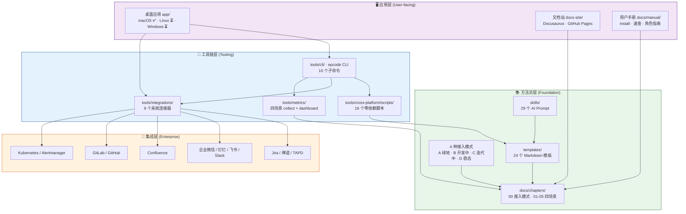
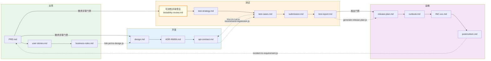
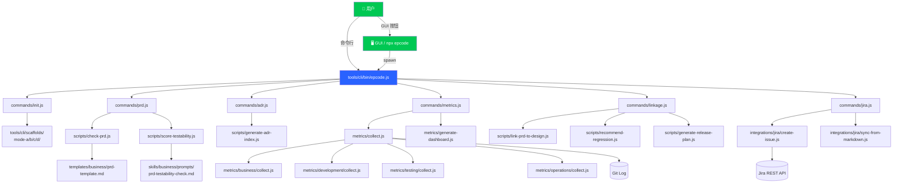
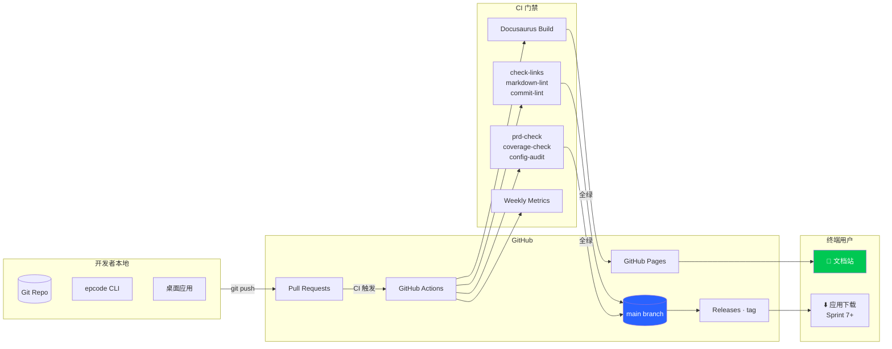

# EP Code AI · 整体架构

> Sprint 6 ① 产出。用一张图 + 四张子图 + 一份技术盘点清单,让新成员 15 分钟内**看懂全局**。
>
> **读者**: 新加入的研发 / 想 contribute 的外部贡献者 / 评估是否采用本框架的团队。
>
> 配套文档:
> - [信息共享模式](./docs/architecture/information-sharing.md)(本文"数据流"章的深化)
> - [UI/UX 设计稿](./docs/design/ui/)(应用层的详细设计)
> - [PLAN.md](./PLAN.md)(建设路线图)
> - [用户手册](./docs/manual/)(怎么用)

---

## 一、全局四层视图

EP Code AI 由**四层**组成,每一层对上层提供能力,对下层提出约束:



### 分层原则

| 层 | 核心命题 | 稳定性 | 变更频率 |
|----|---------|--------|---------|
| L1 方法论 | **什么是对的** | 最稳定 | 季度级 |
| L2 工具链 | **如何自动化** | 中等 | 月级 |
| L3 集成 | **连到企业系统** | 依赖外部 | 按需 |
| L4 应用 | **人类怎么用** | 最活跃 | 周级 |

**依赖方向**: L4 → L3 → L2 → L1,不跨层反向依赖。

---

## 二、数据流图 · Markdown 在四场景间流动

> ⚠️ 重要: **测试不是开发下游**,测试从 PRD 阶段就**与开发并行**参与(可测性评审)。这是 [`测试篇`](./docs/chapters/04-testing/) 的核心设计 —— 不要把它画成串行链。



**关键观察**:
- **业务产出是"双消费"**: PRD 同时推给开发(开始设计)和测试(做可测性评审)。两条线**并行启动**,不是串行
- **测试是业务的并行下游,不是开发的下游**: 测试可测性评审是一个**门禁**,评审通过后业务才算真正交付
- **开发 ↔ 测试 双向**: API 契约是开发 + 测试共同锁定(测试从用例角度反推 API 是否可测,开发从实现角度反推用例是否可编)
- **实线 = 产出物+门禁**,**虚线 = Sprint 4 联动脚本**(自动检测触发下一环)
- **闭环**: 运维 → 业务(复盘改进项)→ PRD → 开发+测试 并行
- 每个节点都是 **Git 里的 Markdown 文件**,不是数据库记录

### 为什么测试要提前并行参与?

这是测试方法论的核心观点(详见 `docs/chapters/04-testing/FULL.md § 1`):

| 🤔 传统做法 | ✅ 本框架做法 |
|-----------|-------------|
| 业务写完 PRD → 开发写代码 → 给测试 | 业务写 PRD → 开发 + 测试**同时**接手 |
| 测试在提测时才发现"验收标准模糊" | PRD 评审时就卡住模糊需求,回炉重写 |
| Bug 发现在测试阶段,改动成本高 | 把"可测性"作为**PRD 的准出门禁** |
| 开发 - 测试 信息不对称,临近上线才对齐契约 | API 契约从需求阶段就共同设计 |

- `tools/cross-platform/scripts/check-prd.js` + `score-testability.js` 就是这套理念的自动化
- 本仓库 `docs/chapters/04-testing/04-gates/requirements-gate.md` 专门定义了"需求评审门禁"

详细扩展见 [docs/architecture/information-sharing.md](./docs/architecture/information-sharing.md)。

---

## 三、组件依赖图 · CLI 如何调工具



**核心架构**:
- CLI 是**薄 router**,每个子命令 `require` 现成的 `tools/cross-platform/scripts/*.js`
- 脚本全部**零 npm 依赖**,只用 Node 18+ 内置 `fetch` / `fs` / `child_process`
- GUI(桌面应用)在底层也 spawn 同一批 CLI 命令,保证 GUI 和 CLI 行为一致

---

## 四、部署架构



**关键特性**:
- **零服务端成本**: GitHub Pages(Docusaurus)+ GitHub Actions(CI)全免费(公开仓库)
- **单一真实源**: `main` branch 是所有产出物的权威来源
- **自动部署**: Docusaurus 文档站每次 main 变动时自动发布
- **Release**: 打 tag v0.x.0 → GitHub Release 页面 + 后续桌面应用安装包

---

## 五、技术盘点清单 · 还缺什么

> **方法**: 从技术视角审视每一层,找出"还没有但应该有"的部分。按优先级分为 P0/P1/P2。

### L1 方法论层

| 项 | 现状 | 差距 | 优先级 | 目标 Sprint |
|----|------|------|--------|-----------|
| 四场景方法论 | ✅ 完整 | - | - | - |
| 4 接入模式 | ✅ 完整 | - | - | - |
| 模板库 | ✅ 24 个 | - | - | - |
| Prompt 库 | ✅ 29 个 | 🟡 缺 frontmatter(GUI 用) | P1 | S7 |
| **术语表 / 词汇表** | ❌ 无 | 新人不知道专有词含义 | P1 | S8 |
| **角色职责矩阵** | 🟡 分散在篇章 | 没单页速查 | P2 | S10 |

### L2 工具链层

| 项 | 现状 | 差距 | 优先级 | 目标 |
|----|------|------|--------|-----|
| CLI 10 个命令 | ✅ | - | - | - |
| 脚本 16 个 | ✅ | - | - | - |
| 度量 4 场景 | ✅ | - | - | - |
| **类型定义(TS 或 JSON Schema)** | ❌ 纯 JS | 模板/PRD/用例无结构校验 Schema | P1 | S8 |
| **插件机制** | ❌ | 企业想加自己的 check 要 fork | P2 | Phase 3 |
| **观测性(日志/追踪)** | 🟡 console | CI 排障靠 raw log | P2 | Phase 3 |
| **性能基准(benchmark)** | ❌ | 不知道脚本在大仓库是否够快 | P2 | Phase 3 |
| **测试覆盖** | 🟡 手工 dogfood | 脚本没自动化测试 | P1 | S7 |

### L3 集成层

| 项 | 现状 | 差距 | 优先级 | 目标 |
|----|------|------|--------|-----|
| Jira / 禅道 / TAPD | ✅ | - | - | - |
| Confluence | ✅ | - | - | - |
| IM 5 种 | ✅ | - | - | - |
| GitLab / GitHub | ✅ | - | - | - |
| K8s / Alertmanager | ✅ | - | - | - |
| **OIDC / SAML SSO** | ❌ | 企业身份打通 | P1 | S9 RFC |
| **Prometheus exporter** | ❌ | 把 metrics 暴露给企业监控 | P2 | Phase 3 |
| **OpenTelemetry** | ❌ | 跨系统追踪 | P2 | Phase 3 |

### L4 应用层

| 项 | 现状 | 差距 | 优先级 | 目标 |
|----|------|------|--------|-----|
| 桌面应用(macOS Swift) | 🟡 骨架 | 未打包 / 未签名 / 无自动更新 | P0 | S7 |
| Linux 桌面应用 | ❌ | 需跨平台栈决策 | P0 | S7-S8 |
| Windows 桌面应用 | ❌ | 同 Linux | P0 | S7-S8 |
| 文档站(Docusaurus) | ✅ 已上线 | 搜索 / 版本切换 | P1 | S8 |
| 用户手册 | 🟡 起步 | 完整三平台安装 + 角色指南 | P0 | S6-S8 |
| **多语言(英文)** | ❌ 仅中文 | 对外开源需要 | P2 | Phase 3 |
| **离线 AI 模型** | ❌ | 企业禁外网时无 AI | P2 | Phase 3 |

### 横向能力(贯穿各层)

| 项 | 现状 | 差距 | 优先级 |
|----|------|------|--------|
| **审计日志** | ❌ 无 | 合规场景要审计谁改了啥 | P1 (S9 RFC) |
| **服务端同步** | ❌ Git-only | 跨机器共享项目上下文难 | P1 (S9 RFC) |
| **用户身份 / 权限** | 🟡 设计稿 | GUI 设计稿有,后端没有 | P0 (S7 落地 GUI) |
| **OTA 客户端更新** | ❌ | 无法远程推更新给用户 | P1 (S9 RFC) |
| **数据备份 / 恢复** | 🟡 依赖 Git | Artifact 大文件超出 Git 能力 | P2 |
| **可观测性仪表板** | 🟡 METRICS.md | 静态 Markdown,无实时仪表板 | P2 |

---

## 六、三种部署拓扑(按企业需求)

### 6.1 最小部署 · 单人开发者 / 小团队

```
 [本地 Git] ─ push ─► [GitHub/GitLab 仓库]
                            │
                            └─► 成员 clone/pull
 [本地桌面应用] ─ spawn ─► [CLI] ─ 读 ─► [本地 Git]
```

零依赖。适合: 个人项目 / 初创 / 独立项目组。

### 6.2 企业部署 · 有现成协作系统

```
 [本地 Git] ─ push ─► [企业 GitLab]
                         │
                         └── CI (.gitlab-ci.yml) ──► [Jira / Confluence]
                                                     [企业微信/钉钉/飞书]

 [桌面应用] ─► [Jira API]      (本地存储默认)
              [Confluence API]
              [SSO (OIDC/SAML)] (Phase 3)
```

企业系统是**镜像/广播**,Git 仍是权威。

### 6.3 完整企业服务化 · Phase 3 规划中

```
 [多成员桌面应用] ──► [企业网关]
                       │
                       ├── [EP Code AI 后端服务] (PLAN § ④)
                       │    ├── 用户 / 项目 / 事件流
                       │    ├── 审计日志
                       │    ├── 客户端 OTA
                       │    └── 跨成员协同
                       │
                       ├── [Git]
                       ├── [Jira / 禅道]
                       └── [Confluence]
```

需要专门开发服务端,见 PLAN.md § Phase 2 ④ 服务端同步服务 RFC。

---

## 七、不做什么(关键的负约束)

**本框架不会做的事**(避免范围蔓延):

| ❌ 不做 | 理由 |
|--------|------|
| 自己做 IDE | VS Code / JetBrains 已足够;我们做 "**在 IDE 外** 的方法论 + 协作" |
| 自己做 Git 托管 | GitHub / GitLab 已完美;我们是它们的**消费方** |
| 自己做监控系统 | Prometheus / Datadog 已成熟;我们是**消费监控数据**的一方 |
| 自己做 AI 模型 | 我们依赖 Claude 等大模型;不做模型训练 |
| 替代现有流程工具 | Jira / 禅道用户继续用,我们做**结构化数据注入** |
| 无 AI 模式 | 核心价值来自 AI 辅助;纯手工模式不是目标 |

## 八、关键技术决策一览

这些决策在 `docs/adr/` 和本仓库的 history 里已有,这里提炼速查:

| 决策 | 选择 | 原因 |
|------|------|------|
| 文档格式 | Markdown | Git 友好 / 工具链成熟 / 跨平台 |
| 脚本语言 | Node.js 18+ 内置(零 npm) | 跨平台 / 零依赖 / 易学 |
| 桌面应用首平台 | macOS Swift | 团队熟悉 / 原生体验;后续决策跨平台栈 |
| 文档站 | Docusaurus v3 | 社区成熟 / MDX 支持 / GitHub Pages 直接部署 |
| CI | GitHub Actions | 公开仓免费 / 生态完整 |
| AI | Claude API(Anthropic 官方)优先 | 代码能力强 / 支持长上下文 |
| 用户身份(Phase 2) | 本地 Keychain | 单用户 / 不依赖服务端 |
| 用户身份(Phase 3) | 企业 SSO (OIDC) | 正规企业必备 |

---

## 九、进一步阅读

- [PLAN.md](./PLAN.md) · 5 Sprint 建设计划 + Phase 2 落地规划
- [docs/architecture/information-sharing.md](./docs/architecture/information-sharing.md) · 数据流详述
- [docs/design/ui/](./docs/design/ui/) · UI/UX 设计稿
- [docs/chapters/00-adoption/](./docs/chapters/00-adoption/) · 4 种接入模式详情
- [CHANGELOG.md](./CHANGELOG.md) · 每个 Sprint 的具体产出
- [RELEASE_PROCESS.md](./RELEASE_PROCESS.md) · 发布 SOP
