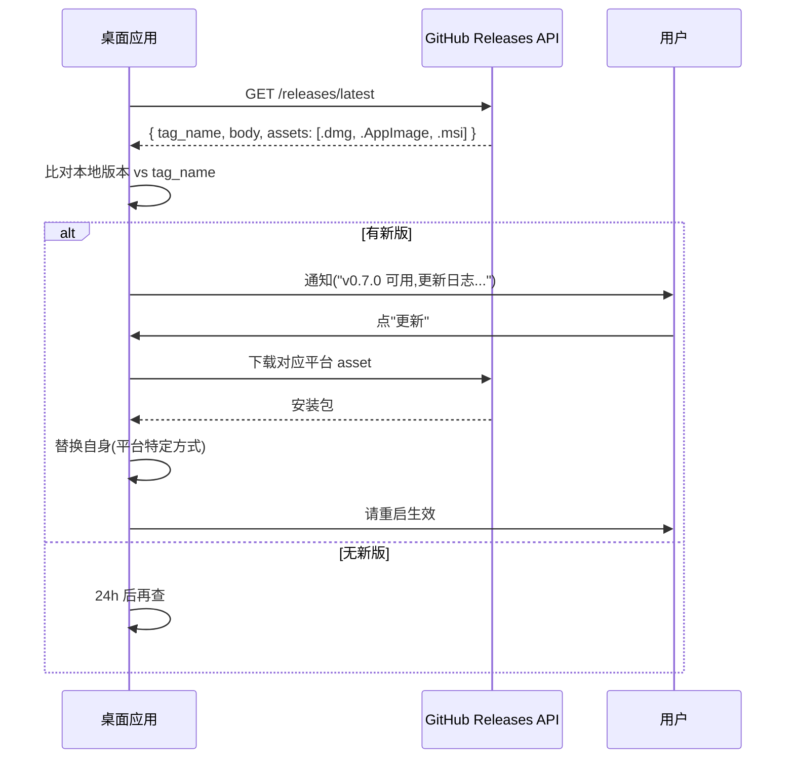

# ADR-0003: 桌面应用自动更新策略 · GitHub Release 为源

## 状态

**Proposed** — Sprint 7 提议

## 日期

2026-04-20

## 参与决策

| 姓名 | 角色 |
|------|------|
| 张工 | 架构师 |

## 背景与上下文

桌面应用要有自动更新通道,否则用户永远停留在装机时的版本,出新功能 / 修 bug 推不下去。

跨平台 + 无付费服务器 + 混合方案(ADR-0002 macOS Swift + Linux/Win Tauri) 的约束下,
需要一套**统一**的更新发现 + 下载 + 应用机制。

### 要解决的问题

- 新版发布后,如何让**已安装用户**知道?
- 下载安装包从哪里来(不能用企业 CDN 因为零付费)?
- macOS / Linux / Windows 三平台的更新机制差异很大,如何统一?
- 强制更新 vs 可选更新如何区分(安全漏洞 / 一般新功能)?

### 约束

- 零付费服务器,不能用 Cloudflare/AWS CDN
- 必须跨 3 平台一致
- 用户隐私:更新检查不上报任何 PII

## 备选方案

### 方案 A · Sparkle (macOS 原生)+ 各平台自建

- **优点**: macOS 生态最成熟,VSCode / 众多 Mac 应用用它
- **缺点**: 只管 macOS;Linux/Win 要各自造轮子
- **不适合混合方案**

### 方案 B · Tauri Updater(Tauri 官方)

- **优点**: Tauri 2.x 内置,跨三平台一致
- **缺点**:
  - 只在 Tauri 侧工作;**macOS Swift 版本要单独实现**
  - 需要一个"update server"(但支持静态文件托管,可用 GitHub Release)

### 方案 C · 自研统一协议(选此,简化版)

基于 GitHub Release 的 JSON manifest + HTTP 下载,三平台共用:

- **服务端**: GitHub Release · 完全免费 · API 公开
- **客户端**: 每次启动 + 每 24h 检查一次 manifest,发现新版提示用户
- **manifest**: `https://api.github.com/repos/epcode-ai/ep-code-ai/releases/latest`
  - 自动包含 `tag_name / body / assets`
- **增量更新**: Phase 3 再考虑,目前全量下载(Tauri ~10MB 可接受)

## 决定

采用 **方案 C · 基于 GitHub Release 的统一协议**,三平台共用核心逻辑 + 平台特定安装器。

### 流程



### 平台特定的"替换自身"

| 平台 | 方式 |
|------|------|
| macOS | 解压 .dmg → 替换 `/Applications/EP Code AI.app` → 要求用户重启 |
| Linux | AppImage 直接替换文件 + 重启;deb 调 `dpkg -i` |
| Windows | 下载 .msi → 启动 msiexec · 应用关闭自身 |

### 强制更新 vs 可选更新

Release 的 body 用 frontmatter 约定:

```yaml
---
severity: critical | recommended | optional
min-supported: 0.5.0
---

## 新版本特性
...
```

- `severity: critical` 或本地版本 < `min-supported` → **强制**,应用无法使用直到更新
- `severity: recommended` → 弹通知,用户可选"稍后"
- `severity: optional` → 仅在设置页显示"有新版可用"

## 后果

### 正面

- **零服务器成本**: 完全依赖 GitHub
- **三平台统一**: 核心协议相同,只有"替换自身"差异
- **签名验证**: GitHub Release asset 的 SHA256 由 API 自带,可验完整性
- **用户透明**: 下载 URL 是 github.com,用户知道来源

### 负面

- **依赖 GitHub**: GitHub 出事时无法更新(但整个开源生态都这样)
- **rate limit**: GitHub API 匿名请求 60/h,用户量大时需要加 token 或缓存
  - 缓解: 客户端缓存 24h,不重复查
- **增量更新**: 暂不支持,每次全量下载 10-20MB
- **企业内网**: 内网用户访问不到 github.com,需要企业镜像 —— Phase 3 考虑

### 需持续关注

- **日活 > 1000 用户时**,考虑加 GitHub App token 提升 rate limit
- **强制更新的合理性**:只用于严重安全漏洞,不能用于"运营需要"
- **遥测**(谁在用哪个版本):本 ADR 不做,Phase 3 服务端 RFC(PLAN § ④)里考虑

## 实施路径

### Sprint 7(规划)

- ✅ 写本 ADR
- ❌ 实际代码留给 Sprint 7.x

### Sprint 8(macOS 实现)

- 在 Swift 应用里实现 `UpdateChecker` 类
- 启动时 + 每 24h 查 GitHub API
- 有新版弹通知 + 用户点更新 → 下载 + 替换

### Sprint 8-9(Tauri 实现)

- Tauri 侧 Rust `update_checker` command
- 复用 Tauri 官方 updater 插件(底层仍调 GitHub)

### Sprint 10(可选)

- 压力测试:模拟 1000 并发检查,看 GitHub rate limit 是否触发

## 相关

- [ADR-0002](./0002-cross-platform-desktop-stack.md) · 跨平台栈决策(本 ADR 的前置)
- [RELEASE_PROCESS.md](../../RELEASE_PROCESS.md) · 发版流程 · 需加 "Release Body 必须含 severity frontmatter"
