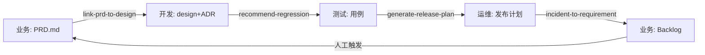

# 当前阶段信息共享模式

> Sprint 6 ⑤ 产出。把 PLAN.md 里讨论的"Git + Markdown + CI 三件套"固化成正式文档。
>
> **读者**: 想知道"没有服务端时,怎么做跨场景 / 跨成员协作" 的人。

---

## 一、核心模型

```
┌────────────────────────────────────────────────────────────────┐
│          当前信息共享模式(无中心化服务端)                     │
├────────────────────────────────────────────────────────────────┤
│                                                                │
│   ┌─────────┐   ┌─────────┐   ┌─────────┐   ┌─────────┐        │
│   │  产品   │ → │  开发   │ → │  测试   │ → │  运维   │        │
│   └────┬────┘   └────┬────┘   └────┬────┘   └────┬────┘        │
│        │             │             │             │              │
│     PRD.md        设计+ADR      用例+提测单   Runbook/复盘       │
│     业务规则      API 契约       Bug 报告      发布计划          │
│        │             │             │             │              │
│        └─────────────┴─────────────┴─────────────┘              │
│                             ↓                                   │
│                      ┌──────────────┐                           │
│                      │   Git 仓库    │  ← 唯一真实源           │
│                      │  main branch  │                          │
│                      └──────┬───────┘                           │
│                             ↓                                   │
│                 ┌───────────────────────┐                      │
│                 │ CI 门禁                │                      │
│                 │ + 跨场景联动脚本        │ ← 自动触发下一环    │
│                 │ + 度量采集 (每周)       │                      │
│                 └──────────┬────────────┘                      │
│                             ↓                                   │
│                 ┌───────────────────────┐                      │
│                 │ Jira / 禅道 / IM /     │ ← 可选镜像/广播      │
│                 │ Confluence / Slack    │   (非权威源)          │
│                 └───────────────────────┘                      │
└────────────────────────────────────────────────────────────────┘
```

## 二、四个核心特征

### 2.1 Git = 唯一真实源

- 所有产出物都是 Git 里的 **Markdown 文件**(或 YAML / JSON)
- 不存在"数据库里有一份、仓库里有另一份"的双写
- diff / blame / revert / branch 这些 Git 原生能力**全部白嫖**

### 2.2 PR / MR = 协作边界

- 改动必须走 Pull Request(本仓库 branch protection 强制)
- 评审在 Git 平台(GitHub / GitLab)完成,不在 Jira 评论里
- `CODEOWNERS` 自动分派评审人
- CI 不绿不许合

### 2.3 CI = 触发器 + 门禁

每次 PR 自动跑:
- **门禁类**(不过 → 阻塞合入): `check-prd` · `coverage-check` · `config-audit` · `commit-lint`
- **提示类**(不过 → warning): `markdown-lint` · `check-links`
- **联动类**(PR 改了 PRD → 自动提示测试): `link-prd-to-design`
- **归档类**(main 上): `adr-index-sync` 自动重建 ADR 索引

每周一定时:
- `metrics-weekly` 跑 4 场景 collect 脚本 + 生成 METRICS.md 看板

### 2.4 企业系统 = 镜像 / 广播层

Jira / Confluence / 企业微信 / 钉钉 等**是镜像**,不是权威:
- Git 里的 PRD → `epcode jira sync` 同步到 Jira Issue(便于 PM 跟进)
- Git 里的故障复盘 → 用 IM 机器人广播到群(便于全员周知)
- **Git 改了,Jira 自动追**(反向不成立)

这样做的代价: Jira 有的,Git 里不一定有(如:某些 issue 的讨论);Git 有的,Jira 里一定会追上。

---

## 三、按场景详述产出物流向

### 3.1 业务产出

| 产出物 | 生产者 | 消费者 | 消费方式 |
|-------|--------|--------|---------|
| `docs/prd/*.md` | 产品 | 测试(可测性评审)<br>开发(需求理解) | 读文件 + CI `check-prd` 自动提示 |
| `docs/business/user-stories/*.md` | 产品 | 开发(拆任务)<br>测试(写用例) | 读文件 |
| `docs/business/business-rules/*.md` | 产品 | 开发(编码)<br>测试(边界) | 读文件 |
| `CHANGE-LOG.md` | 产品(CR 管理) | 全员 | 读文件 + IM 广播 |

### 3.2 开发产出

| 产出物 | 生产者 | 消费者 | 消费方式 |
|-------|--------|--------|---------|
| `docs/design/*.md` | 开发 / 架构 | 测试(设计评审)<br>运维(部署评估) | 读文件 |
| `docs/adr/NNNN-*.md` | 开发 / 架构 | 未来的开发 / 新人 | 读文件 + `generate-adr-index` 索引 |
| `docs/api/*.md` | 开发 | 测试(契约用例)<br>其他系统(对接) | 读文件 + CI 契约冲突检测 |
| `RELEASE-NOTE.md` | 开发 | 运维(发布)<br>用户 | 读文件 + IM 广播 |

### 3.3 测试产出

| 产出物 | 生产者 | 消费者 | 消费方式 |
|-------|--------|--------|---------|
| `docs/test/strategy-*.md` | 测试负责人 | 全员(评审) | 读文件 + 评审会议 |
| `docs/test/cases/*.md` | 测试 | 开发(交叉审)<br>测试 CI | 读文件 + `coverage-analysis` 脚本 |
| `docs/test/submission-*.md` | 开发(提交)<br>测试(审核) | 测试(决定接不接) | 读文件 + CI `submission-check` |
| `docs/test/bug-reports/*.md` | 测试 | 开发(修) | 读文件 + `epcode jira sync` 同步 |
| `docs/test/report-*.md` | 测试负责人 | 运维(发布决策) | 读文件 + `generate-release-plan` |

### 3.4 运维产出

| 产出物 | 生产者 | 消费者 | 消费方式 |
|-------|--------|--------|---------|
| `docs/ops/release-plan-*.md` | SRE / 发布人 | 全员 | 读文件 + IM 广播 |
| `docs/ops/runbooks/*.md` | SRE | 值班人员(出事看) | 读文件 + 告警附带链接 |
| `docs/ops/incidents/INC-*.md` | 值班 / SRE | 全员 | 读文件 + IM 广播 |
| `docs/ops/postmortems/*.md` | 事件负责人 | 全员 + 业务 backlog | 读文件 + `incident-to-requirement` |
| `METRICS-operations.md` | CI 自动 | 管理层 / SRE 团队 | 读文件(每周更新) |

---

## 四、跨场景联动(Sprint 4 产出)

4 个脚本把上面的"单向流动"串成**闭环**:



| 联动 | 脚本 | 触发时机 | 产出 |
|------|------|---------|------|
| 业务 → 开发 | `link-prd-to-design.js` | PRD PR 里 | 受影响设计清单(+评审建议) |
| 开发 → 测试 | `recommend-regression.js` | 代码 PR 里 | 建议回归用例列表 |
| 测试 → 运维 | `generate-release-plan.js` | 准出后 | 发布计划草稿 |
| 运维 → 业务 | `incident-to-requirement.js` | 复盘时 | GH Issue / Jira Task 批量 |

触发方式:
- 手动: `epcode linkage <type>`
- 自动: 在 CI workflow 里配置相应 `changes` 过滤

---

## 五、优点 vs 缺点 · 坦诚分析

### ✅ 优点

| 优点 | 说明 |
|------|------|
| **零后端成本** | 每个项目私仓 = 自己的数据库,无需运维 |
| **完全离线可用** | 除通知类集成外,整套可在 air-gapped 环境跑 |
| **Diff / Blame / Revert 天然支持** | Git 40 年积累的能力全部可用 |
| **工具链成熟** | Markdown / Git / CI 生态极其丰富 |
| **跨工具互操作** | Obsidian / VS Code / Typora / Logseq 都能读 Markdown |
| **数据主权清晰** | 数据在自己仓库,企业不担心外泄 |

### ❌ 缺点(诚实面对)

| 缺点 | 说明 | 缓解 / 解决 |
|------|------|-----------|
| **跨仓库统计难** | 公司 100 个项目,想看全局指标要 100 次 clone | Phase 3 服务端聚合 |
| **全员审计难做** | Git 只能看 commit,看不到"张三昨天点了多少次 /prd" | Phase 3 服务端事件流 |
| **Git 对非技术人员有门槛** | PM / 业务同学 `git pull` 不顺手 | 桌面应用(Sprint 7+)封装 |
| **非文本产出支持弱** | 设计稿 / 视频 / 音频 不适合 Git(LFS 能缓解但不完美) | 外链 + Git 存引用 |
| **权限粒度粗** | Git 层是"能读整个仓或读不了整个仓",不分文件 | 接入企业 SSO + CODEOWNERS 缓解 |
| **离线协作难** | 没网时,改动无法推送给别人 | 本地 Git 分支 + 恢复后 push |

### 何时考虑上服务端(Phase 3)

以下**任一**条件满足时,值得投资 Phase 3 服务端(PLAN § ④):
- 公司有 **10+ 项目**同时使用本框架,需要跨项目看板
- 有合规要求(金融 / 医疗等)需要**完整审计日志**
- 团队里 **50%+ 非技术人员**(PM / 业务 / 运维)用不惯 Git
- 需要**实时协同**(两人同时编辑一个 PRD)
- 需要**OTA 推送**强制客户端升级(安全漏洞时)

---

## 六、最小起步 · 某团队用这套方法论的 Day 1

**假设**: 一个 5 人团队,有 GitHub 企业账号,用企业微信。

1. **Day 1 上午**: 在 GitHub 建仓库 → `git clone` → 跑 `npx epcode init --mode=A --name=<项目>`
2. **Day 1 下午**: 产品用模板写 PRD 初稿 → 推 PR
3. **Day 2**: PR 触发 CI,`prd-check` 自动评审结构 → 测试同学在 PR 里留可测性意见
4. **Day 3**: 合入,`adr-index-sync` 自动建 ADR 索引 → 开发开始写设计 ADR
5. **Week 1 周五**: `metrics-weekly` 自动生成第一份周报 → IM 机器人推到群

**这就是全部**。没装过服务端,没配过单独的数据库。

---

## 七、反模式 · 不要这样用

| ❌ 反模式 | 为什么不行 | 正确做法 |
|---------|----------|---------|
| 把 Jira 当权威源,Git 里的 Markdown 是 "给 AI 看的" | 双写必然不一致 | 反过来: Git 权威,Jira 用 `sync` 脚本镜像 |
| 手工同步 PRD 变更到 Confluence | 人必然忘 | `epcode jira sync` / Confluence publish 脚本 |
| 在 Slack 里讨论技术决策,不写 ADR | 3 个月后没人记得为什么这么选 | 讨论后必须落 ADR |
| 不跑 CI 就合 PR | 方法论失效 | branch protection 强制 |
| 改了 PRD 不通知测试 | 测试漏评审,上线出问题 | CI 自动跑 `link-prd-to-design` 提示 |

---

## 八、相关文档

- [ARCHITECTURE.md](../../ARCHITECTURE.md) · 本文的上层视图(四层架构)
- [PLAN.md § Phase 2 ⑤](../../PLAN.md) · 本文的初稿来源
- [docs/chapters/](../chapters/) · 每场景方法论详情
- [tools/cli/](../../tools/cli/) · `epcode` CLI 入口
- [examples/leave-management-system/](../../examples/leave-management-system/) · 端到端实例
