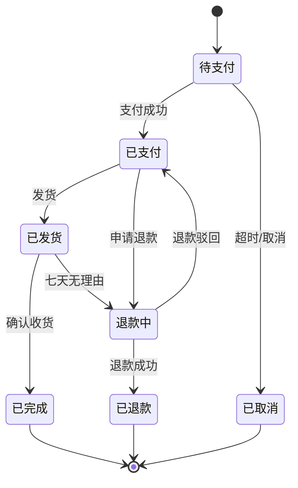

# 业务篇 · 03 · 业务规则管理

## 本章目标

让复杂的业务规则**结构化、可维护、可追溯**，而不是散落在 PRD 的各个段落里。

## 一、为什么要单独管理业务规则

**散落式的问题**：

```
"金额 >= 100 元的普通用户享 5% 折扣，VIP 10%，
 但新用户首单可加 5%，但周末促销期间打 8 折不叠加，
 优惠券不能与折扣同时使用，除非是节日大促..."
```

读完一遍脑子就乱了。

**结构化的解法**：

| 条件 | 结果 | 备注 |
|------|------|------|
| 金额 < 100 | 无折扣 | |
| 普通用户 + 非首单 | 5% | |
| 普通用户 + 首单 | 10% | |
| VIP + 非首单 | 15% | |
| VIP + 首单 | 20% | |

一目了然。

## 二、决策表（Decision Table）

### 2.1 基本形式

```markdown
| # | 条件1 | 条件2 | 条件3 | 结果 |
|---|-------|-------|-------|------|
| 1 | A1 | B1 | C1 | R1 |
| 2 | A1 | B2 | C1 | R2 |
| ...
```

### 2.2 完整示例：订单退款规则

| # | 订单状态 | 下单时长 | 商品类型 | 退款金额 | 备注 |
|---|---------|---------|---------|---------|------|
| 1 | 待支付 | 任意 | 任意 | 100% | 直接取消 |
| 2 | 已支付/未发货 | ≤ 24h | 任意 | 100% | |
| 3 | 已支付/未发货 | > 24h | 普通 | 100% | |
| 4 | 已支付/未发货 | > 24h | 定制 | 90% | 扣 10% 手续费 |
| 5 | 已发货 | ≤ 7 天 | 普通 | 100% + 退运费 | 七天无理由 |
| 6 | 已发货 | ≤ 7 天 | 定制 | 不支持退款 | |
| 7 | 已发货 | > 7 天 | 任意 | 走售后流程 | 需客服审核 |
| 8 | 已完成 | ≤ 15 天 | 任意 | 走售后流程 | 需客服审核 |
| 9 | 已完成 | > 15 天 | 任意 | 不支持退款 | |

### 2.3 决策表的好处

- ✅ 开发可以直接翻译成代码（switch/case 或规则引擎）
- ✅ 测试可以直接对每一行设计用例（一行一个 test case）
- ✅ 变更时只改对应行，不影响其他规则
- ✅ 容易发现逻辑漏洞（列不全就露馅）
- ✅ 跨角色沟通成本低

## 三、状态机（State Machine）

### 3.1 什么场景用状态机

对象有**多种状态**，状态间有**转换规则**时：

- 订单（待支付 → 已支付 → 已发货 → 已完成）
- 工单（待处理 → 处理中 → 待验证 → 已关闭）
- 用户账号（待激活 → 激活 → 冻结 → 注销）

### 3.2 状态转换表

**订单状态机示例**：

| 当前状态 | 触发事件 | 条件 | 新状态 | 副作用 |
|---------|---------|------|-------|-------|
| 待支付 | 支付成功 | - | 已支付 | 扣库存、发站内信 |
| 待支付 | 超时 | 30 分钟未支付 | 已取消 | 释放库存 |
| 待支付 | 用户取消 | - | 已取消 | 释放库存 |
| 已支付 | 发货 | 管理员操作 | 已发货 | 发短信通知 |
| 已支付 | 退款申请 | ≤ 24h 或未发货 | 退款中 | 冻结订单 |
| 已发货 | 确认收货 | 用户操作或自动（15 天） | 已完成 | 结算佣金 |
| 已发货 | 退款申请 | 七天无理由 | 退款中 | 生成退货单 |
| 退款中 | 退款成功 | - | 已退款 | 恢复库存、返款 |
| 退款中 | 退款驳回 | - | 恢复原状态 | 通知用户 |

### 3.3 状态图（推荐用 Mermaid）



### 3.4 状态机的质量清单

- [ ] 每个状态都有明确的入/出口
- [ ] 每个转换都有明确的触发事件
- [ ] 每个转换都有明确的前置条件
- [ ] 每个转换的副作用都列清楚
- [ ] 没有"孤岛状态"（进不去或出不来）
- [ ] 异常状态有回退路径

## 四、规则的存放形式

### 4.1 三档存放策略

| 复杂度 | 存放方式 | 示例 |
|-------|---------|------|
| 简单规则 | PRD 里行内描述 | "密码长度 8-32 字符" |
| 中等复杂 | PRD 独立章节 + 表格 | 订单退款规则 |
| 非常复杂 | 独立文档 / 规则引擎 | 保险理赔规则 |

### 4.2 规则 ID 命名

所有业务规则都给一个**可追溯 ID**：

```
BR-<模块>-<编号>

例如:
- BR-ORDER-001   订单退款规则
- BR-ORDER-002   订单状态转换
- BR-USER-001    账号冻结条件
- BR-PAYMENT-001 支付失败重试策略
```

好处：
- 代码里可以注释引用：`// see BR-ORDER-001`
- 测试用例可以关联：`TC-042 验证 BR-ORDER-001 规则 3`
- 变更时容易定位影响

## 五、规则变更管理

### 5.1 变更必走的流程

```
提出变更 ──► 影响分析 ──► 评审 ──► 版本化 ──► 下游同步
            （产品）     （全员）  （文档）    （开发/测试）
```

### 5.2 影响分析表

变更前必须填：

| 项目 | 内容 |
|------|------|
| 被变更的规则 ID | BR-ORDER-001 |
| 变更内容 | VIP 折扣从 15% → 18% |
| 影响的代码模块 | order-service/discount.ts |
| 影响的测试用例 | TC-042, TC-043, TC-044 |
| 影响的存量数据 | 进行中的订单需特殊处理 |
| 下游依赖 | 报表系统、数据仓库 |
| 上线时机 | 需要与运营沟通促销节点 |

### 5.3 规则版本化

```markdown
## BR-ORDER-001 订单退款规则

**当前版本**: v2.3
**历史版本**: v2.2 (2026-03-01), v2.1 (2025-12-15), v2.0 (2025-09-01), v1.0

### v2.3 (2026-04-15)
- 定制商品退款手续费从 5% → 10%

### v2.2 (2026-03-01)
- 新增"七天无理由"类目白名单
...
```

## 六、用 AI 辅助维护业务规则

### 6.1 用 AI 检查规则完整性

```
Prompt:
我有一组业务规则，帮我检查：
1. 是否有遗漏的条件组合
2. 是否有相互冲突的规则
3. 是否有不可达的规则（永远不会触发的）
4. 是否有边界模糊的规则

规则内容:
[粘贴决策表]
```

### 6.2 用 AI 把自然语言转成决策表

```
Prompt:
把下面的业务描述转成决策表，要求：
1. 列出所有条件变量
2. 枚举所有可能的组合
3. 输出 markdown 表格
4. 标注未明确的情况（需要产品确认）

业务描述:
[粘贴 PRD 里的一段文字]
```

## 七、配套资源

- [01 PRD 编写规范](./01-prd-standards.md)
- [02 用户故事与验收标准](./02-user-stories.md)
- [04 需求变更管理](./04-change-management.md)
- [05 AI 辅助业务分析](./05-ai-assistance.md)
