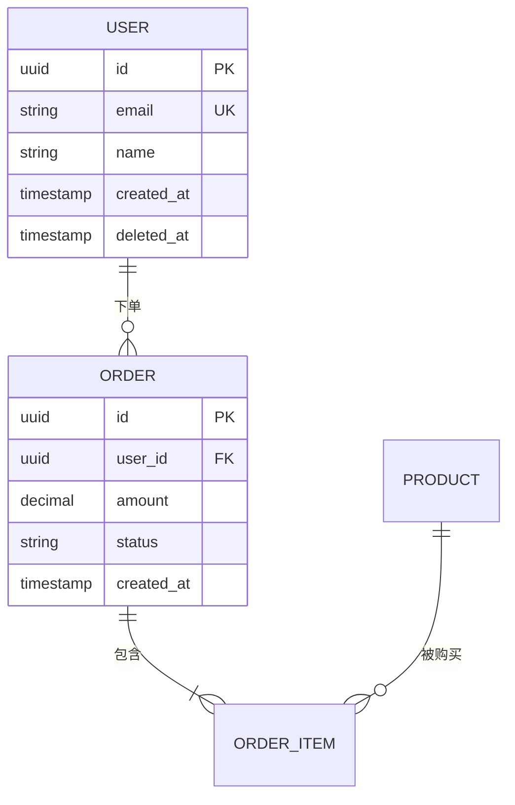
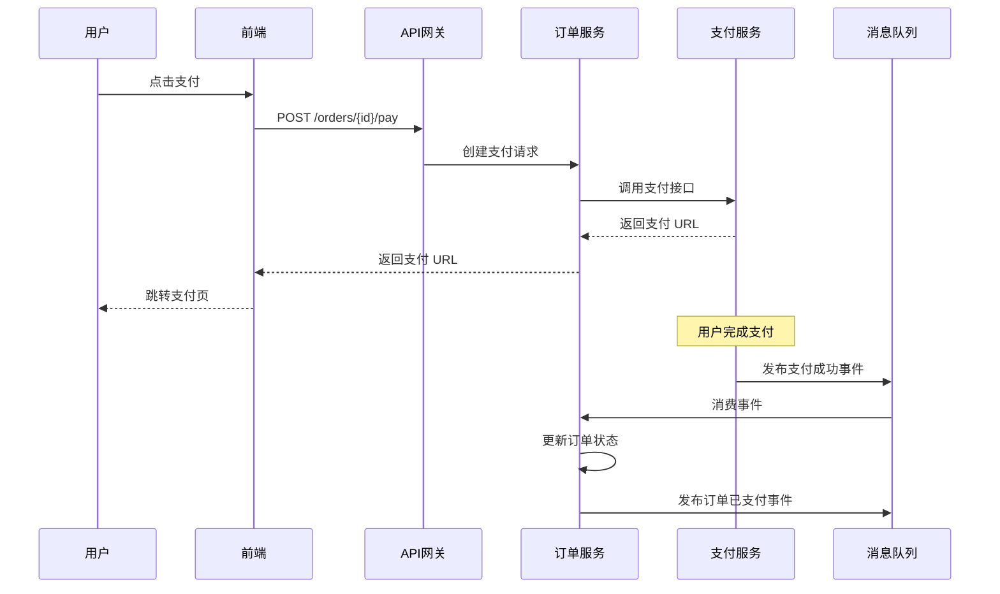

# 开发篇 · 01 · 设计规范

## 本章目标

让开发产出的**设计文档、架构决策、接口契约**标准化，可被下游（测试、运维）直接使用。

## 一、设计阶段的三类文档

| 文档 | 受众 | 目的 |
|------|------|------|
| **概要设计** | 产品 / 架构 / 开发 / 测试 | 方案论证，核心决策 |
| **详细设计** | 开发内部 | 具体实现指导 |
| **ADR**（架构决策记录） | 全员 | 记录"为什么选这个方案" |

## 二、概要设计文档模板

```markdown
# [需求名称] 概要设计 v[版本]

## 1. 背景与目标
   1.1 需求背景（引用 PRD 链接）
   1.2 设计目标
   1.3 非目标（明确不做什么）

## 2. 现状分析
   2.1 现有系统架构
   2.2 现有数据模型
   2.3 现有瓶颈

## 3. 总体方案
   3.1 架构图
   3.2 关键模块
   3.3 数据流
   3.4 依赖的外部系统

## 4. 方案选型
   4.1 备选方案列表（至少 2 个）
   4.2 对比维度（性能、成本、复杂度、维护性）
   4.3 推荐方案及理由

## 5. 关键设计点
   5.1 数据模型（ER 图）
   5.2 接口契约（引用 API 文档）
   5.3 核心流程（时序图）
   5.4 异常处理策略
   5.5 扩展性考虑

## 6. 非功能性设计
   6.1 性能目标与设计
   6.2 可用性设计（SLA、容灾）
   6.3 安全性设计
   6.4 可观测性设计（监控埋点、日志）

## 7. 迁移与发布
   7.1 数据迁移方案
   7.2 灰度策略
   7.3 回滚方案

## 8. 对依赖方的要求
   8.1 对测试的要求（环境、数据、契约）
   8.2 对运维的要求（部署、监控）

## 9. 风险与遗留
   9.1 已识别风险
   9.2 技术债
   9.3 待后续处理的事项

## 10. 附录
   - 参考资料
   - 变更历史
```

## 三、架构决策记录（ADR）

### 3.1 什么是 ADR

ADR（Architecture Decision Record）是一份**记录单次架构决策**的轻量级文档。

**好处**：
- 后人接手时能看到"为什么这样设计"
- 避免重复讨论同一个问题
- 决策可追溯、可复盘

### 3.2 ADR 模板

```markdown
# ADR-0001: 使用 PostgreSQL 作为主数据库

## 状态
Accepted（已采纳） / Proposed（提议中） / Deprecated（已废弃） / Superseded by ADR-XXXX

## 日期
2026-04-15

## 背景
我们需要选择主数据库。候选：MySQL、PostgreSQL、MongoDB。
当前场景：强事务、复杂查询、预计数据量 500GB。

## 决策
使用 PostgreSQL 15。

## 理由
1. 原生支持 JSON 字段，适合半结构化业务数据
2. 全文搜索能力优于 MySQL
3. 团队已有 PG 经验
4. 事务隔离级别更严格

## 后果

### 正面
- 复杂查询性能好
- 可以减少一个 ElasticSearch 依赖

### 负面
- 运维工具生态弱于 MySQL
- 团队需要补充备份/恢复 SOP

## 替代方案（未选）
- MySQL：事务和 JSON 支持弱
- MongoDB：不满足强事务要求
```

### 3.3 ADR 存放规则

```
project-root/
└── docs/
    └── adr/
        ├── 0001-use-postgresql.md
        ├── 0002-adopt-clean-architecture.md
        ├── 0003-microservice-boundaries.md
        └── README.md  ← 索引
```

**规则**：
- 编号递增，不删不改
- 废弃的 ADR 保留，状态改为 `Deprecated`
- 被替代的 ADR 写明"Superseded by ADR-XXXX"

## 四、数据模型设计

### 4.1 必备元素

| 元素 | 要求 |
|------|------|
| 实体名 | 单数 + 大驼峰（`User`，不是 `users`） |
| 字段名 | 小写 + 下划线（`user_id`） |
| 主键策略 | 明确说明（自增 / UUID / 雪花） |
| 索引 | 标注每个索引的用途 |
| 外键 | 明确是否使用，以及级联策略 |
| 软删除 | 明确是用 `deleted_at` 还是物理删除 |

### 4.2 ER 图推荐用 Mermaid



## 五、接口契约

详见 [API 契约模板](../../../templates/testing/api-contracts/api-template.md)。

### 接口设计 9 条原则

1. **RESTful 风格**：`GET /users/123`，不是 `/getUser?id=123`
2. **版本化**：`/api/v1/...`
3. **统一响应结构**：`{ code, msg, data }`
4. **分页用 cursor 或 page+size**，不要用 offset（大数据量性能差）
5. **时间统一用 ISO 8601**，并注明时区
6. **金额用字符串或 int**，不用 float
7. **列表查询必须支持筛选和排序**
8. **幂等性设计**：PUT/DELETE 天然幂等；POST 需要用 `Idempotency-Key`
9. **错误码分层**：`2xxx` 业务错误、`5xxx` 系统错误

## 六、时序图

### 6.1 用于描述跨模块/跨服务的交互



### 6.2 时序图里必须明确

- 每个参与者（Actor / Service）
- 每次交互的**协议**（HTTP / gRPC / MQ / ...）
- **同步 vs 异步**
- **重试 / 超时**策略
- **异常路径**

## 七、异常处理策略

### 7.1 异常分类

| 类别 | 处理策略 | 示例 |
|------|---------|------|
| 业务异常 | 返回明确错误码和提示 | 余额不足 |
| 参数异常 | 400 + 字段错误清单 | 邮箱格式错误 |
| 认证/权限异常 | 401/403 | Token 过期 |
| 资源异常 | 404 | 订单不存在 |
| 冲突异常 | 409 + 指引 | 重复提交 |
| 限流异常 | 429 + Retry-After | QPS 超限 |
| 系统异常 | 500 + 不暴露细节 + 记录 traceId | 数据库连接失败 |
| 依赖异常 | 503 + 降级 | 第三方服务不可用 |

### 7.2 错误响应统一结构

```json
{
  "code": 1001,
  "msg": "用户名或密码错误",
  "data": null,
  "traceId": "req-20260415-abc123",
  "timestamp": "2026-04-15T10:30:00Z"
}
```

## 八、设计评审

### 8.1 评审时机

- 概要设计：需求评审后 1 周内
- 详细设计：编码前（开发内部评审即可）
- ADR：重大决策时（架构师主持）

### 8.2 评审 Checklist

**架构合理性**：
- [ ] 方案对齐了需求目标
- [ ] 非功能需求（性能、安全、可扩展）有设计
- [ ] 有方案对比，有决策理由
- [ ] 依赖的外部系统已明确

**可测试性**（测试视角）：
- [ ] 每个模块可独立测试
- [ ] 接口契约清晰（字段、错误码、边界）
- [ ] 异常场景有设计
- [ ] 有足够的可观测性（日志、监控点）

**可运维性**（运维视角）：
- [ ] 部署方式已明确
- [ ] 监控埋点已设计
- [ ] 灾备和回滚方案齐备

**可维护性**：
- [ ] 代码结构分层清晰
- [ ] 关键决策已记录为 ADR
- [ ] 文档完整

## 九、配套资源

- [02 代码评审](./02-code-review.md)
- [03 分支策略](./03-branch-strategy.md)
- [API 契约模板](../../../templates/testing/api-contracts/api-template.md)
- [开发 → 测试 契约](../04-testing/03-roles-contracts/dev-contract.md)

## 附：ADR 索引自动生成

每个 `docs/adr/` 目录下的 ADR 文件遵循 `NNNN-<slug>.md` 命名后，可用下面的脚本自动生成（或在 CI 里校验）`README.md` 索引：

```bash
# 生成/更新索引
node tools/cross-platform/scripts/generate-adr-index.js --target docs/adr/

# CI 校验（索引不是最新时退出 1,提示本地重跑）
node tools/cross-platform/scripts/generate-adr-index.js --target docs/adr/ --check
```

本仓库 `.github/workflows/ci.yml` 的 `adr-index-sync` job 会在 PR 改了 ADR 时自动校验；GitLab 方案见 `workflows/gitlab/.gitlab-ci.example.yml` 的 `adr-index` job（支持推送到默认分支时自动提交刷新后的索引）。
