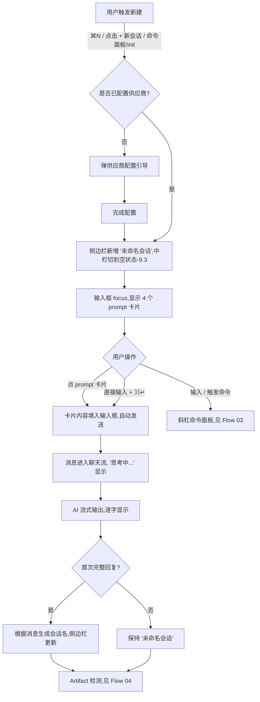
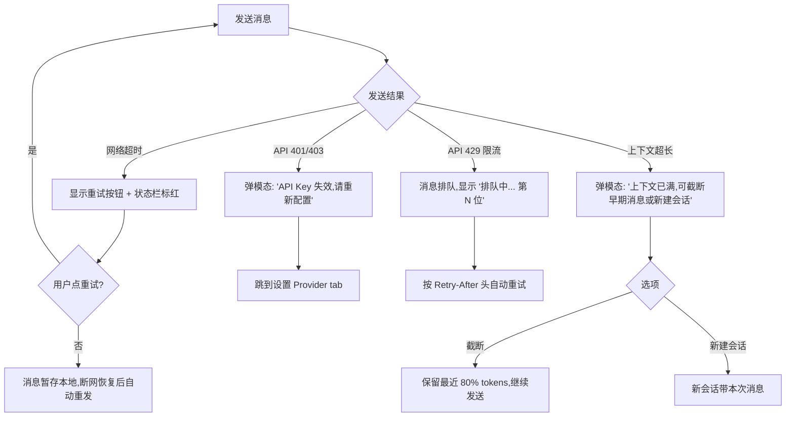

# Flow 01 · 新建会话

> 从触发新建到 AI 出现首条回复的完整流程。

## 主流程



## 异常分支



## 关键时序

| 步骤 | 期望延迟 |
|------|---------|
| 触发新建 → 中栏切到空状态 | < 50ms |
| 发送消息 → "思考中..." 出现 | < 100ms |
| "思考中..." → 首字符显示 | 500ms - 3s(供应商决定) |
| 首次回复完成 → 自动命名出现 | < 500ms 后台异步 |

## 自动命名规则

调用 AI 一次额外的轻量请求:
```
prompt: "用 5-15 字概括以下对话主题,只回答主题:\n用户: <第一条消息>\nAI: <第一条回复>"
model: 用 haiku 或当前供应商最便宜的模型(降本)
```

失败 fallback: 取用户首条消息前 20 字 + "..."
