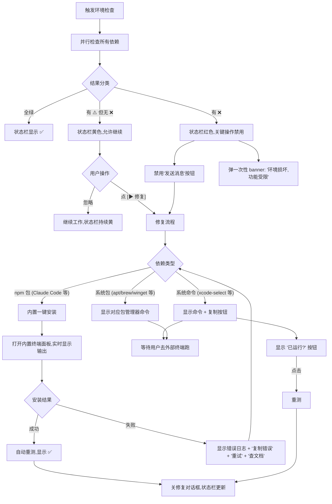

# Flow 02 · 环境检查失败的兜底引导

> 任何时机检测到环境问题(启动 / hover 状态栏 / 跑命令前)的统一处理。

## 主流程



## 修复对话框线框图

```
┌─────────────────────────────────────────────────────────────────┐
│  🔧 修复环境问题                                          ✕     │
├─────────────────────────────────────────────────────────────────┤
│                                                                 │
│  发现 2 个问题,正在协助修复:                                       │
│                                                                 │
│  ❌ Claude Code 未安装                                            │
│     需要: @anthropic-ai/claude-code 全局安装                     │
│     [▶ 一键安装]                                                  │
│                                                                 │
│  ❌ Xcode CLT 未安装 (macOS)                                      │
│     需要: 系统命令工具                                             │
│     [📋 复制命令: xcode-select --install]                         │
│     ⚠️ 此项需在外部终端执行,完成后点 [✓ 已运行,重测]              │
│                                                                 │
│  ─────────────────────────────────────────────────────────     │
│  内置终端                                                        │
│  ┌───────────────────────────────────────────────────────────┐  │
│  │ $ npm install -g @anthropic-ai/claude-code               │  │
│  │ npm WARN deprecated ...                                  │  │
│  │ added 234 packages in 12s                                │  │
│  │ ✅ 安装完成,版本 v1.2.3                                  │  │
│  └───────────────────────────────────────────────────────────┘  │
│                                                                 │
│                         📋 复制日志    重新检查   关闭          │
└─────────────────────────────────────────────────────────────────┘
```

## 不打扰原则

- **启动时**: 不主动弹模态,只在状态栏标色,用户主动点才修复
- **跑命令前**: 如果命令依赖某个缺失项,弹模态;否则放行
- **常驻提示**: 每天最多 1 次顶部 banner,点 ✕ 关闭后当天不再提
- **修复成功**: 不打扰,只更新状态栏,2 秒淡入淡出 ✅ 提示

## 修复脚本来源

每种依赖的修复命令定义在 `tools/cross-platform/scripts/fixes/<dependency>.json`:

```json
{
  "name": "Claude Code",
  "check": "claude --version",
  "minVersion": "1.0.0",
  "install": {
    "darwin": ["npm", "install", "-g", "@anthropic-ai/claude-code"],
    "linux": ["npm", "install", "-g", "@anthropic-ai/claude-code"],
    "win32": ["npm.cmd", "install", "-g", "@anthropic-ai/claude-code"]
  },
  "manualHint": {
    "darwin": "xcode-select --install"
  }
}
```

应用启动加载这个目录,自动构建检查清单 + 修复策略。
