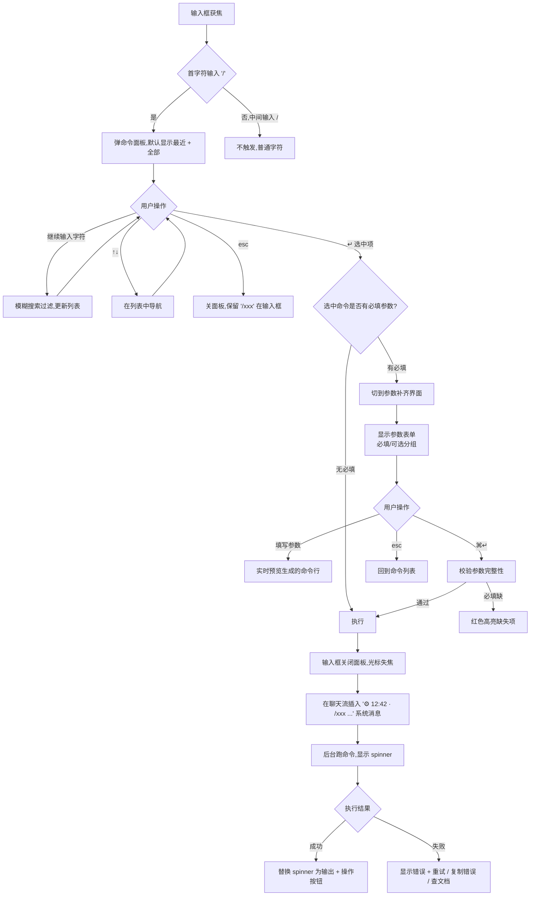

# Flow 03 · 斜杠命令调用 + 自动补全 + 执行

> 输入框首字符 `/` 触发命令面板,选命令,补参数,执行。

## 主流程



## 参数补齐表单设计

参数类型 → UI 控件:

| 类型 | UI |
|------|-----|
| `string` | 单行输入框 |
| `text` | 多行 textarea |
| `enum` (limited choices) | radio group |
| `boolean` | checkbox |
| `file` | 输入框 + 浏览按钮(系统文件对话框) |
| `dir` | 同 file,但只选目录 |
| `number` | 数字输入,带 min/max 校验 |

## 命令元数据来源

```js
// tools/cli/commands/init.js
/**
 * @command init
 * @description 按接入模式起项目
 * @category project
 * @param {enum:A,B,C,D} mode 接入模式 (必填)
 * @param {string} name 项目名 (必填)
 * @param {dir} dir 目标目录 (可选,默认当前)
 */
```

应用启动时扫描 `tools/cli/commands/*.js`,解析 JSDoc 头建命令注册表。
新增 CLI 子命令 → GUI 自动支持,无需改 GUI 代码。

## 输出渲染

命令输出在聊天流中以特殊样式呈现:

```
⚙ 12:42  ·  /init --mode=B --name=payment-service
   ✅ 已初始化 B 模式项目: ./payment-service
      复制 4 个文件
      下一步: cd payment-service && cat README.md

   [📂 在 Finder 中打开]   [📋 复制路径]   [📤 发送到 AI 评审]
```

按钮:
- **在 Finder/资源管理器中打开**: 平台原生
- **复制路径**: 剪贴板
- **发送到 AI 评审**: 把命令输出作为消息发给 AI,常用于 "看 metrics 后让 AI 解读"

## 性能与限制

- 命令面板打开延迟 < 50ms (本地索引)
- 模糊搜索 < 20ms
- 命令执行有 30s 超时,超时显示 "进程未结束,继续等待 / 取消"
- 同一会话内可并发跑多个命令(各自独立 spinner)

## 历史 / 收藏

- 最近用 5 条持久化(本地)
- 用户可右键命令 → "收藏"(收藏的命令永远在列表前部)
