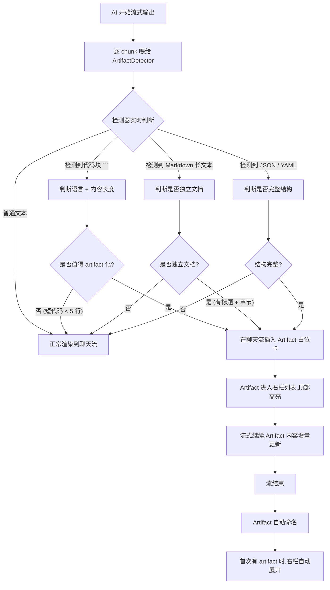
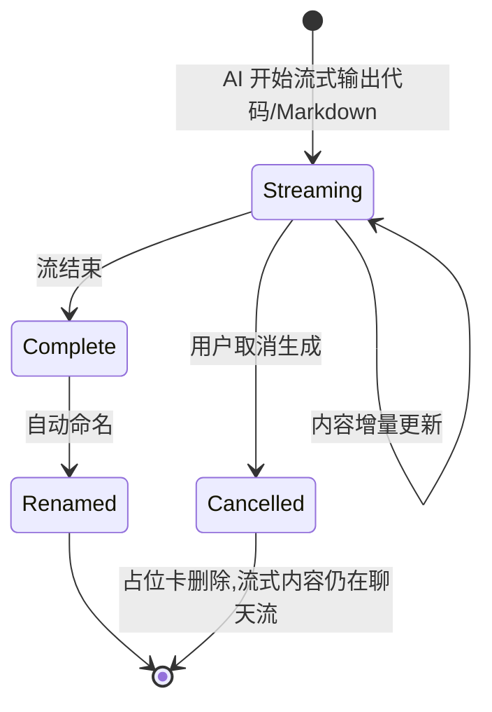

# Flow 04 · AI 输出 → 自动识别为 Artifact

> AI 流式输出代码块/Markdown/JSON 等结构化内容时,自动抽取为 Artifact,加进右栏。

## 主流程



## 抽取规则

### 4.1 代码块

- 触发: ` ``` ` fenced code block
- 长度门槛: ≥ 5 行 OR ≥ 200 字符
- 文件名提取: 优先从 ```language:filename 提取,否则用 `<lang>-<时间戳>.<ext>`
- 例外: 单行命令(如 `` `npm install` ``)不抽取

### 4.2 Markdown 文档

- 触发: 检测到首行 `# `(一级标题) + 至少 1 个 `## `(二级标题)
- 长度门槛: ≥ 50 行 OR ≥ 1000 字符
- 文件名: 从 H1 标题转换(slug)+ `.md`

### 4.3 结构化数据

- JSON: 完整对象 `{...}`,长度 ≥ 100 字符
- YAML: `---` 起始或显著缩进结构
- CSV: 显著表格结构

## 视觉反馈

```
聊天流中:                                    右栏 Artifacts:

🤖 11:33                                     ▾ user-stories.md  ← 新加,1.5s
  我帮你拆成 8 条 user story:                   📋 8 条 · 4KB
                                                生成于 11:35
  ┌──────────────────────────────────────┐
  │ 📄 user-stories.md                    │
  │ 8 条 user story · 已添加到右栏         │
  │ [👁 查看] [📋 复制] [💾 保存到文件]    │
  └──────────────────────────────────────┘

  生成完成。详见右侧。
```

## 占位卡的状态



## 用户选项

设置 → General 提供:
- `[✓] 自动 Artifact 化 AI 输出`(默认开)
- 长度阈值可调

如果关掉,所有代码/文档都直接渲染在聊天流,右栏永远空。

## Artifact 类型与图标

| 类型 | 扩展名 | 图标 | 大纲 |
|------|--------|------|------|
| Markdown | .md | 📄 | 标题 |
| JavaScript / TypeScript | .js .ts | 💛 / 🔷 | function/class/export |
| Python | .py | 🐍 | def/class |
| JSON / YAML | .json .yml | { | 顶层 keys |
| HTML | .html | 🌐 | DOM 结构 |
| 图表 (mermaid) | .mmd | 📊 | 节点 |
| 通用 | .txt | 📝 | 无 |

## 与 Phase 1 的关系

抽取逻辑已有 `app/ClaudeCodeHistory/ArtifactDetector.swift` 雏形。本设计稿明确:

- 把"长度门槛"统一(原 Swift 版只检测代码块)
- 加 Markdown 文档抽取
- 流式更新 Artifact 内容(原 Swift 版仅在流结束时抽)
