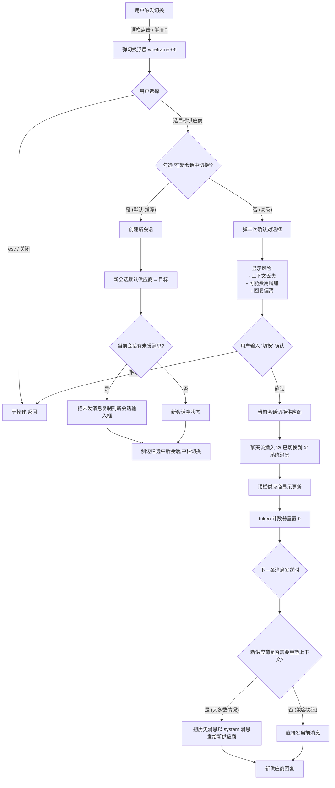
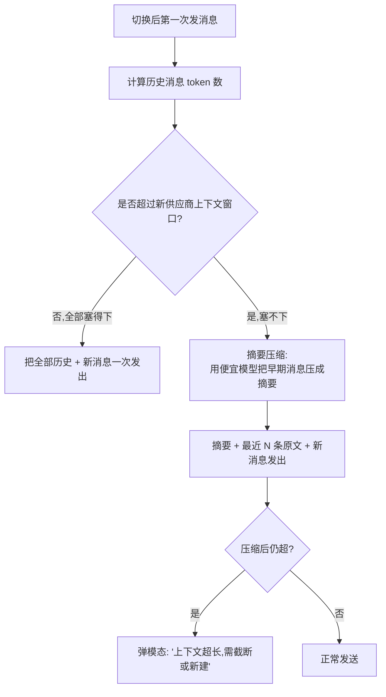
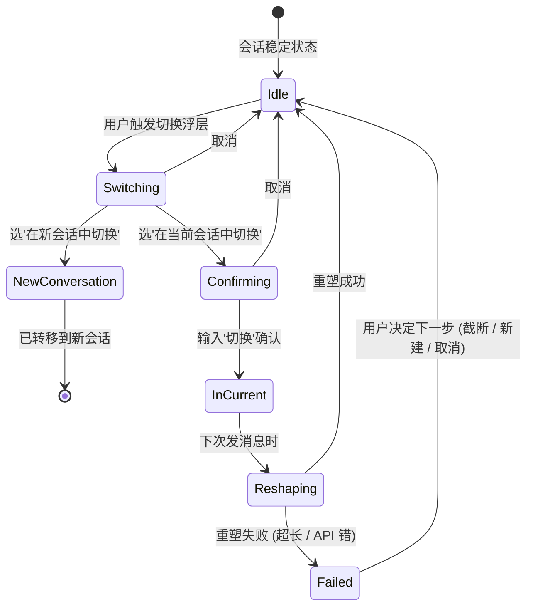

# Flow 05 · 会话中切换供应商的影响处理

> 这是个潜在风险操作 —— 切换不当会丢上下文 / 增费用。流程要明确预警 + 给安全默认。

## 主流程



## "重塑上下文" 详细策略



## 状态机



## 切换的用户消息

切换的系统消息样式:

```
⚙ 12:51  · 切换供应商
   Anthropic Claude opus  →  AWS Bedrock claude-opus-4-v1

   📊 影响:
   • 历史 156k tokens 将以摘要形式重塑
   • 预估额外费用: $0.18 (摘要 + 重塑)

   [📋 看摘要预览]   [🔙 撤销切换]
```

撤销窗口: 3 分钟内可点 "🔙 撤销切换" 回到原供应商,撤销后系统消息标 "已撤销"。

## 用户教育

第一次用户做 "在当前会话切换" 时:

```
        ┌──────────────────────────────────────────────┐
        │  💡 高级操作 · 仅这一次提示                    │
        ├──────────────────────────────────────────────┤
        │                                               │
        │  你正在做"会话内切换",这是一个高级操作。      │
        │                                               │
        │  大多数情况下,"在新会话中切换"更安全:           │
        │  ✓ 不丢历史                                    │
        │  ✓ 无重塑费用                                  │
        │  ✓ 回复方向更稳定                              │
        │                                               │
        │  会话内切换适合: 临时尝试不同模型对比同一问题    │
        │                                               │
        │  [✓] 知道了,不再提示                           │
        │                              继续切换 →        │
        └──────────────────────────────────────────────┘
```

## 失败处理

切换后第一次发送失败的处理:

| 失败类型 | 行为 |
|---------|------|
| API 401/403 | 弹模态 "新供应商鉴权失败,要回退到原供应商吗?" |
| 上下文超长 | 弹模态 "无法重塑全部上下文,选择: 截断早期 50% / 新建会话 / 切回原" |
| 网络 | 重试 3 次,仍失败弹 "切换可能未生效,看右上状态" |

## 与 Sprint 1-5 的对接

- 切换日志写入会话历史 JSON,key: `provider_switches: [{ timestamp, from, to, reshape_strategy }]`
- 度量脚本 `tools/metrics/development/collect.js` 可加新维度: 周内供应商切换次数(衡量稳定性)
