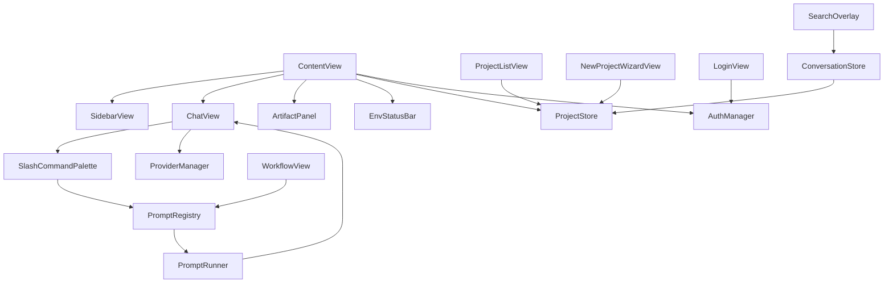

# Swift 改造清单 · 对齐 UI 设计稿 · Sprint 7 实施计划

> Sprint 7 产出。针对 `app/ClaudeCodeHistory/` 22 个现有 Swift 文件,
> 列出**具体要改什么 / 改多少 / 优先级**,让 Sprint 7.x 多轮 PR 能按清单推进。

**前提**:
- 已决定 macOS 保留 Swift(见 [ADR-0002](../../adr/0002-cross-platform-desktop-stack.md))
- 对齐的设计稿: [`docs/design/ui/prototype/`](./prototype/) 17 个 HTML 原型
- 当前 Swift 代码仅是 Sprint 1 前的快速原型,功能未严格按设计稿

---

## 一、改造总览

| 类别 | 文件数 | 工作量 |
|------|-------|--------|
| ➕ 新增 Swift 文件 | 7 | ~4 周 |
| ✏️ 重构现有文件 | 10 | ~2 周 |
| 🔍 小幅调整 | 5 | ~3 天 |
| 🗑 可能废弃 | 0 | - |

**总估算**: 约 6 周工作量,分 3-4 轮 PR。

---

## 二、按优先级分级(P0 → P2)

### P0 · 必须 Beta 发布前完成

#### 1. ContentView.swift(三栏主视图 · 改造)

- ✅ 现状: 有三栏雏形
- 🎯 改造:
  - 顶栏从单一"标题"扩展为: 🚀 brand + 项目切换器 + 场景导航 + 供应商选择 + ⚙ + 用户头像
  - 底部加持久化状态栏(引用 wireframe 10)
- 参考原型: [`01-main-three-pane.html`](./prototype/01-main-three-pane.html)
- 工作量: **中 · 2-3 天**

#### 2. SidebarView.swift(侧边栏 · 改造)

- ✅ 现状: 有会话列表
- 🎯 改造:
  - 分组头(▼ 今天 / 昨天 / 本周 / ...)
  - 每项左侧加 6px 圆点 + active 状态蓝色左边框
  - 收藏 ⭐ 分组固定置顶
  - 右键菜单(wireframe 08)
  - 底部 "+ 新会话 ⌘N" 按钮
- 参考原型: [`01`](./prototype/01-main-three-pane.html) + [`08`](./prototype/08-conversation-context-menu.html)
- 工作量: **大 · 4-5 天**

#### 3. ChatView.swift(聊天区 · 改造)

- ✅ 现状: 基础消息显示
- 🎯 改造:
  - 消息头: 时间 + "思考 12s · 输出 2.3k tokens" 信息
  - 用户消息右对齐 + AI 消息左对齐
  - 附件 chip(`[📎 prd-v1.2.md 132 行]`)
  - 底部输入栏工具条: [/] [📎] [⚡ opus] · 右侧 `⌘↵ 发送`
  - 流式输出逐字显示(现有逻辑需核对)
- 参考: [`01`](./prototype/01-main-three-pane.html) § 聊天区
- 工作量: **中 · 3 天**

#### 4. SetupWizardView.swift(首次向导 · 大改)

- ✅ 现状: 步骤 1-2
- 🎯 改造:
  - 加步骤 3(供应商配置)+ 步骤 4(完成)
  - 4 步顶部进度条点击可跳转
  - 步骤 2 每个环境检查项旁加"▶ 一键安装"按钮
  - 步骤 3 测试连接功能 + 余额/延迟展示
- 参考: [`02`](./prototype/02-setup-wizard.html)
- 工作量: **大 · 3-4 天**

#### 5. SettingsView.swift(设置页 · 重构)

- ✅ 现状: 单页混合
- 🎯 改造为 **4 tab** 布局:
  - 通用 / 供应商 / 快捷键 / 实验性
  - 每 tab 独立视图 · 左侧导航条 · 底部"取消 / 保存"按钮
  - "保存"按钮 dirty 状态感知(有修改才高亮)
- 参考: [`03`](./prototype/03-settings.html)
- 工作量: **大 · 4 天**

#### 6. ProviderManager.swift(供应商管理 · 扩展)

- ✅ 现状: 单供应商
- 🎯 改造:
  - 支持多供应商(Anthropic / AWS Bedrock / Google Vertex / 自定义代理)
  - 每个供应商独立的连接测试 + 余额/延迟
  - 切换供应商浮层的数据源
  - 切换时的上下文处理(新会话 vs 当前会话)
- 参考: [`03 Provider tab`](./prototype/03-settings.html) + [`06`](./prototype/06-provider-switcher.html)
- 工作量: **大 · 5 天**

#### 7. 🆕 SlashCommandPalette.swift(新增)

- ⭐ 全新组件
- 功能:
  - 输入框首字符 `/` 触发浮层
  - 从 `tools/cli/commands/*.js` 扫描 frontmatter 建命令注册表
  - 模糊搜索 + 参数补齐
  - 执行后把结果作为系统消息插入聊天流
- 参考: [`04`](./prototype/04-slash-command-palette.html) · [`flow-03`](./interaction-flows/03-flow-slash-command.md)
- 工作量: **极大 · 6-8 天**

#### 8. 🆕 EnvStatusBar.swift(从 EHUBInfoBar.swift 重构)

- ✅ 现状: EHUBInfoBar 简单提示
- 🎯 重构为完整状态栏:
  - 左半: 环境健康 · hover 弹详情 tooltip
  - 右半: 网络/供应商状态 · hover 弹延迟/余额
  - 异常时整个状态栏变色(绿/黄/红)
- 参考: [`10`](./prototype/10-env-status-bar.html)
- 工作量: **中 · 3 天**

---

### P1 · 重要但可稍晚

#### 9. 🆕 LoginView.swift + AuthManager.swift(新增)

- 功能: 本地账号(Keychain) + 角色选择 + 预留 SSO 接口
- 登录后跳项目列表(不是直接进主视图)
- 参考: [`11`](./prototype/11-login.html)
- 工作量: **中 · 3 天**

#### 10. 🆕 ProjectListView.swift + ProjectStore.swift + ProjectCard.swift

- 功能:
  - 项目列表,每个带模式徽章(A/B/C/D)
  - 筛选 + 排序
  - 项目的本地持久化(`~/Library/Application Support/EP Code AI/projects.json`)
- 参考: [`16`](./prototype/16-project-list.html)
- 工作量: **大 · 4 天**

#### 11. 🆕 NewProjectWizardView.swift

- 功能: 4 步向导(选模式 → 基本信息 → 起步清单 → 完成)
- 底层调用 `epcode init --mode=X --name=Y`(通过 CLI spawn)
- 参考: [`17`](./prototype/17-new-project.html)
- 工作量: **大 · 4 天**

#### 12. 🆕 WorkflowView.swift + WorkflowStepModel.swift(场景工作流)

- 功能: 12-15 四个场景 HTML 的 Swift 实现(一个视图数据驱动,不是 4 个独立视图)
- 时序 + 当前步骤 + Prompt 卡片
- 参考: [`12-15`](./prototype/12-workflow-business.html)
- 工作量: **极大 · 8 天**

#### 13. 🆕 PromptRegistry.swift + PromptRunner.swift

- 功能:
  - 扫描 `skills/**/*.md` 的 frontmatter 建 Prompt 注册表
  - Prompt 卡片的参数表单 + 组合 prompt + 发送
- 参考: [`wireframe 12-15`](./wireframes/12-15-workflow-scenes.md) 的 "Prompt 元数据"
- 工作量: **大 · 5 天**

---

### P2 · Beta 后补

#### 14. SearchOverlay.swift(⌘K 全局搜索)

- 功能: 跨会话 / Artifact / 命令 / 消息 搜索
- 依赖: ConversationStore 加 FTS5 索引
- 参考: [`07`](./prototype/07-search-overlay.html)
- 工作量: **大 · 5 天**

#### 15. ArtifactPanel.swift 增强

- 现状: 基础列表
- 改造:
  - 右栏自动折叠(无 Artifact 时)
  - 点击 Artifact 进全屏视图(wireframe 05)
  - 版本对比(v2 ↔ v3)- **P2 可延后**
- 参考: [`05`](./prototype/05-artifact-panel-expanded.html)
- 工作量: **中 · 3 天(不含版本对比)**

#### 16. ArtifactDetector.swift 增强

- 现状: 检测代码块
- 改造:
  - 加 Markdown 文档识别(长度 + 结构阈值)
  - 流式增量更新 Artifact(不等流结束)
- 参考: [`flow-04`](./interaction-flows/04-flow-artifact-detect.md)
- 工作量: **小 · 2 天**

#### 17. ConversationStore.swift 扩展

- 加:
  - 项目归属(每个会话所属 project_id)
  - 分组(工作 / 学习等自定义)
  - 批量导出(.md / .json / .zip)
  - 软删除(回收站 30 天)
  - FTS5 搜索索引
- 工作量: **中 · 3 天**

#### 18. 自动更新 UpdateChecker.swift

- 参考: [ADR-0003](../../adr/0003-auto-update-strategy.md)
- 功能: 启动时 + 每 24h 检查 GitHub Releases API
- 工作量: **中 · 3 天**

#### 19. FavoritesManager.swift 小调整

- 对接新的分组系统
- 工作量: **小 · 1 天**

---

## 三、小幅调整(5 个文件)

| 文件 | 调整 |
|------|------|
| `ClaudeCodeHistoryApp.swift` | 启动流程改:未登录 → 登录 → 项目列表;已登录 → 项目列表 |
| `AppSettings.swift` | 扩展 schema:加快捷键自定义字段 + 实验性 feature flags |
| `FileWatcher.swift` | 可能不用改,确认仍在用 |
| `ClaudeProcessManager.swift` | 支持多 Claude 实例(不同供应商) |
| `ConversationNameManager.swift` | 可能不用改 |

---

## 四、Sprint 7.x 推进建议(分 4 轮 PR)

| 轮次 | 目标 | 涉及文件 | 产物 |
|------|------|---------|------|
| **S7.1** | 基础三栏 + 向导 + 设置 | P0 #1-5 | 可启动的 Beta 骨架 |
| **S7.2** | 命令面板 + 状态栏 + 供应商 | P0 #6-8 | 功能完整的 Beta |
| **S7.3** | 登录 + 项目列表 + 新建向导 | P1 #9-11 | 完整用户旅程可走 |
| **S7.4** | 场景工作流 + Prompt 注册表 | P1 #12-13 | Prompt as Feature 上线 |

Sprint 7 结束时: **S7.1 + S7.2 Beta 可下载**(无签名)。
Sprint 8: 完成 S7.3 + S7.4 · 同时启动 Tauri 侧 Linux/Win。
Sprint 9+: P2 逐步补齐 + 搜索 + 自动更新。

---

## 五、跨文件依赖注意

**启动依赖**: `ClaudeCodeHistoryApp` → `AuthManager` → `ProjectStore` → `ContentView`

---

## 六、测试策略

每个 PR 必须包含:
- **单元测试**(Xcode XCTest): 关键 manager / store 类
- **UI 测试**(XCUITest): 每个关键用户旅程 1 条(登录 → 项目 → 主视图)
- **集成测试**: CLI spawn 调用的场景(PromptRunner 最复杂)

目标覆盖率: 60% (Phase 1 方法论要求 ≥ 70%,桌面应用 Phase 2 放宽)

---

## 七、Sprint 7 本轮只做的事(不实际改代码)

本 Sprint 产出:
- ✅ 本文档(改造清单)
- ✅ ADR-0002 跨平台决策
- ✅ ADR-0003 自动更新策略
- ✅ macOS 打包 workflow(无签名版)
- ❌ **不实际修改 Swift 代码**

改代码留给 Sprint 7.1-7.4 多轮推进,需要 Xcode 环境 + 手动测试,适合每天持续推进。
