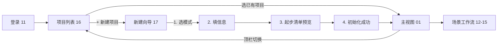

# Wireframe 16-17 · 项目列表 + 新建项目(Sprint 6 新增)

> 补齐 4 种接入模式(A/B/C/D)在 GUI 里的入口。这是框架的一等公民,不能只存在于 CLI 和文档里。

## 完整用户旅程



## 16 · 项目列表

### 布局

```
┌─────────────────────────────────────────────────────────────────┐
│  🚀 EP Code AI                         张工 · 产品              │ ① 顶部窄条
├─────────────────────────────────────────────────────────────────┤
│                                                                 │
│  我的项目                                      [+ 新建项目]     │ ② 标题 + 新建
│  选一个项目进入,或新建项目                                       │
│                                                                 │
│  筛选: [全部] [A·绿地] [B·开发中] [C·迭代中] [D·稳态运维]     │ ③ 筛选条
│                                       排序: 最近访问 ▾          │
│                                                                 │
│  ┌──────────────────┐  ┌──────────────────┐  ┌──────────────┐  │
│  │ 离职流程优化 [A]  │  │ 支付服务 [D]     │  │ 订单导出 [B] │  │ ④ 卡片网格
│  │ 📁 12 📄 8 👥 3  │  │ 📁 32 📄 15 ⚠️   │  │ ...          │  │
│  │ 上次: 11 分钟前   │  │ 上次: 3h 前      │  │              │  │
│  └──────────────────┘  └──────────────────┘  └──────────────┘  │
│                                                                 │
│  ┌──────────────────┐  ┌──────────────────┐  ┌──────────────┐  │
│  │ 移动端App [C]    │  │ 数据分析 [C]     │  │  + 新建项目   │  │
│  │ ...              │  │ ...              │  │              │  │
│  └──────────────────┘  └──────────────────┘  └──────────────┘  │
│                                                                 │
│  ─────────────────────────────────────────────────────────────  │
│  💡 什么是"接入模式"?                                            │ ⑤ 帮助区
│  [A 绿地] [B 开发中] [C 迭代中] [D 稳态] 四张小卡片             │
└─────────────────────────────────────────────────────────────────┘
```

### 卡片元素(必展示)

| 元素 | 数据来源 |
|------|---------|
| 项目名 | 用户填(新建时)或从目录读 |
| 模式徽章 | A/B/C/D 色系区分 |
| 会话数 / 产出物数 / 成员数 | 本地统计 |
| 预警状态 | 如有 P1/P2 事件显示 ⚠️ |
| 简介 | 用户填 |
| 上次访问 | 本地缓存 |
| 当前阶段 | 项目上下文(如"业务/PRD 编写") |

### 模式徽章配色

| 模式 | 色 | 使用场景 |
|------|---|---------|
| A · 绿地 | 绿(成长) | 新项目活力 |
| B · 开发中 | 橙(进行中) | 积极追赶 |
| C · 迭代中 | 蓝(稳定) | 持续进化 |
| D · 稳态运维 | 紫(成熟) | 稳重维护 |

## 17 · 新建项目向导

### 4 步流程

**第 1 步 · 选接入模式** ⭐ 最关键

4 张大卡片,每张含:
- 模式字母 (大字)
- 名称 + 副标题
- 判定条件(2-3 条)
- 适合场景

默认选中 B(最常见情况),用户可点击其他。底部"还不确定?"链接到 `docs/chapters/00-adoption/`。

**第 2 步 · 项目基本信息**

| 字段 | 必填 | 说明 |
|------|-----|------|
| 项目名(英文) | ✓ | 小写 + 短横线,用作目录/仓库名 |
| 显示名 | ✓ | 中文展示名 |
| 描述 | - | 一句话说明 |
| 本地目录 | ✓ | 默认 `~/projects/<项目名>` |
| Git 远程 | - | 暂不关联 / 新建 GitLab / 新建 GitHub / 关联已有 |

**第 3 步 · 起步清单预览**

根据所选模式动态生成:
- 目录树(调用 `tools/cli/scaffolds/mode-{a,b,c,d}/`)
- Checklist(来自对应 mode README 的"起步清单")

用户看清楚"将要发生什么",无意外。

**第 4 步 · 初始化完成**

- 显示成功 + 项目路径
- 按钮: 进入项目 / 在 Finder 中打开
- "下一步建议"block 用文字列 3-4 项

### 底层命令

点"开始初始化"实际执行:
```bash
epcode init --mode=<selected> --name=<projectName> --dir=<targetDir>
```

进度实时在界面反馈(可看到 stdout)。失败时可看日志 + 重试。

## 主视图 (01) 顶栏的项目切换器

```
  🚀 EP Code AI  / [离职流程优化 · A·绿地 ▾]  [💼业务 💻开发 🧪测试 🚀运维]  ... 张工 ▾
                  ↑
              项目切换器: 点击回到项目列表(16)
              显示当前项目名 + 模式徽章
```

4 个场景工作流(12-15)顶栏同样加这个切换器,用户始终知道"我在哪个项目的哪个场景"。

## 权限与协作(Phase 3)

Phase 2 简化实现:项目就是本地目录 + Git 仓库,所有成员通过 Git clone 拿到同一份。

Phase 3(服务端 RFC ④ 落地后):
- 项目有唯一 ID
- 成员通过企业用户体系加入
- 角色权限(Owner / Admin / Member / Viewer)
- 跨成员的事件流聚合(谁改了啥,谁当前在哪个场景)

## Sprint 7 实现影响

| 新 Swift 文件 | 作用 |
|-------------|------|
| `Project.swift` | 项目数据模型 |
| `ProjectStore.swift` | 本地项目列表持久化 |
| `ProjectListView.swift` | 16 页面 |
| `ProjectCard.swift` | 列表卡片 |
| `NewProjectWizardView.swift` | 17 页面 |
| `ModeContext.swift` | 当前项目模式 → 影响工作流 Checklist |

主视图和场景工作流的现有 Swift 文件改造:
- `ContentView.swift` 顶栏加项目切换器
- `WorkflowView.swift` 头部加项目 + 模式信息
- Checklist 内容根据模式动态渲染

## 模式 → 工作流可见性的规则

| 模式 | 业务 | 开发 | 测试 | 运维 |
|------|:----:|:----:|:----:|:----:|
| A · 绿地 | ✅ 全 | ✅ 全 | ✅ 全 | ✅ 全 |
| B · 开发中 | 🟡 追溯补齐 | ✅ 全 | ✅ 全 | 🟡 |
| C · 迭代中 | 🟡 按 level 启用 | 🟡 按 level | 🟡 按 level | 🟡 按 level |
| D · 稳态运维 | ❌ 隐藏 | 🟡 只提测/发布 | 🟡 回归为主 | ✅ 全 |

🟡 = 工作流仍可见但 Checklist 简化或标"可选"。❌ = 入口隐藏。

这样每个模式的用户在 GUI 里只看到"自己该看到的",不被多余功能干扰。
