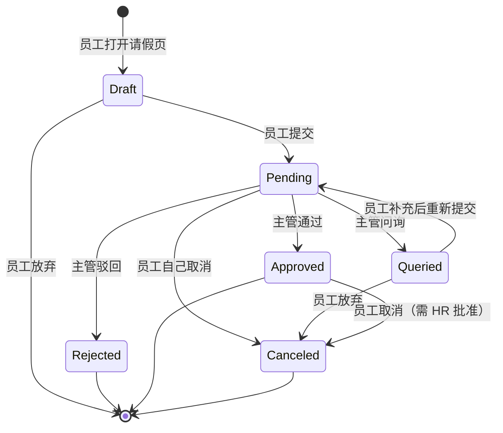

# 员工请假管理系统 · 业务规则

## BR-LEAVE-001 假期类型与额度

**Owner**: HR 负责人张总
**版本**: v1.0
**生效**: 2026-04-01

### 决策表：各假期类型的年度额度

| # | 员工工龄 | 员工级别 | 假期类型 | 年度额度 | 说明 |
|---|---------|---------|---------|---------|------|
| 1 | < 1 年 | 任意 | 年假 | 0 天 | |
| 2 | 1-10 年 | 任意 | 年假 | 5 天 | |
| 3 | 10-20 年 | 任意 | 年假 | 10 天 | |
| 4 | ≥ 20 年 | 任意 | 年假 | 15 天 | |
| 5 | 任意 | 任意 | 病假 | 15 天 | 超出部分走事假 |
| 6 | 任意 | 任意 | 事假 | 15 天 | 无薪 |
| 7 | 任意 | 任意 | 婚假 | 10 天 | 一次性,婚后 1 年内使用 |
| 8 | 任意 | 任意 | 丧假 | 5 天 | 直系亲属 |

### 特殊规则

- R1：新入职员工首个自然年按工作月数 **按比例** 折算年假（如 7 月入职，今年 5 * 6/12 = 2.5 天，向下取整 2 天）
- R2：年假**不跨年结转**（12 月 31 日自动清零）
- R3：病假连续超过 5 天必须附医疗证明,由 HR 审核
- R4：婚假必须在登记结婚后 **12 个月内** 使用，过期作废
- R5：丧假仅限**直系亲属**（父母、配偶、子女）

## BR-LEAVE-002 请假单状态机

### 状态转换表

| 当前状态 | 触发事件 | 条件 | 新状态 | 副作用 |
|---------|---------|------|-------|-------|
| Draft | 员工点提交 | AC-1 通过校验 | Pending | 通知主管 |
| Pending | 主管点通过 | - | Approved | 扣假期余额 + 通知员工 |
| Pending | 主管点驳回 | 原因已填 | Rejected | 通知员工 |
| Pending | 主管点问询 | 问题已填 | Queried | 通知员工 |
| Pending | 员工点取消 | 开始日期 ≥ 今天 | Canceled | 通知主管 |
| Queried | 员工重新提交 | - | Pending | 通知主管 |
| Queried | 问询次数 ≥ 3 | - | Rejected | 通知员工（自动） |
| Approved | 员工点取消 | HR 批准 | Canceled | 退还假期余额 |

### 状态转换约束

- ❌ 不允许从 `Approved` 回到 `Pending`
- ❌ 不允许从 `Rejected` 回到 `Pending`
- ❌ 不允许从 `Canceled` 回到任何状态
- ✅ `Approved` → `Canceled` 必须有 HR 批准操作

## BR-LEAVE-003 余额扣减规则

### 决策表：何时扣、扣多少

| # | 触发 | 假期类型 | 扣减时机 | 扣减数量 |
|---|------|---------|---------|---------|
| 1 | 请假单 Approved | 年假/事假/婚假/丧假 | 审批通过当下 | = 请假天数 |
| 2 | 请假单 Approved | 病假 | 审批通过当下 | = 请假天数 |
| 3 | 请假单 Canceled（从 Approved） | 所有类型 | 取消当下 | 退还 = 原扣减 |
| 4 | 12 月 31 日 23:59 | 年假 | 自动 | 清零未使用余额 |

### 特殊情况

- **半天请假**：扣 0.5 天（UI 支持半天粒度）
- **跨年请假**（如 12/29 - 1/2 跨年）：按自然日分别扣两年的额度
  - 如跨年那年的额度还未开放（HR 未结算），则**禁止**跨年请假
- **病假超额**：若员工年病假 > 15 天，超出部分自动转为事假扣减

## BR-LEAVE-004 审批规则

### 决策表：谁可以审批

| # | 员工级别 | 请假天数 | 请假类型 | 审批人 |
|---|---------|---------|---------|-------|
| 1 | 任意 | ≤ 3 天 | 任意 | 直接主管 |
| 2 | 任意 | 4-7 天 | 任意 | 直接主管 + 上级主管 |
| 3 | 任意 | > 7 天 | 任意 | 直接主管 + HR |
| 4 | 任意 | 任意 | 丧假 | 直接主管（不走长假审批） |
| 5 | VP 及以上 | 任意 | 任意 | 只需自己告知 HR |

> ⚠️ **本期 v1.0 只实现规则 #1**（一级审批）。规则 #2、#3 留到 v2。

### 审批超时规则

- **48 小时未审批**：系统告警提示 HR
- **72 小时未审批**：自动升级到上级主管
- **120 小时未审批**：HR 介入处理

## BR-LEAVE-005 数据保留规则

| 数据 | 保留时长 | 存档方式 |
|------|---------|---------|
| 请假单 | 永久 | 数据库 + 每年归档 |
| 审批日志 | 永久 | 数据库，不允许删除 |
| 操作审计 | 3 年 | 独立审计库 |
| 通知记录 | 90 天 | 到期自动删除 |

## 覆盖度检查（自检）

- [x] 每个条件组合都有对应结果
- [x] 无冲突规则
- [x] 无不可达规则
- [x] 状态机闭合（每个状态都能到达终态）
- [x] 边界情况已考虑（跨年、半天、超额）

## 变更历史

| 版本 | 日期 | 变更人 | 主要变更 |
|------|------|-------|---------|
| v0.1 | 2026-03-15 | 王小花 | 初稿 |
| v0.2 | 2026-03-20 | 王小花 | 与 HR 张总对齐细节 |
| v1.0 | 2026-04-01 | 王小花 | 定稿 |
