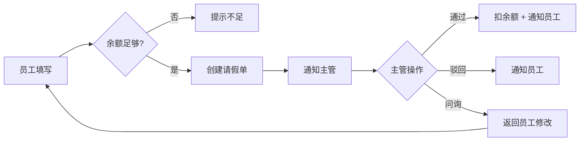

# 员工请假管理系统 - PRD v1.0

**文档 Owner**: 王小花（产品经理）
**最后更新**: 2026-04-01
**状态**: 已批准
**关联需求池**: HRM-Q2-2026

## 1. 概述

### 1.1 背景

公司规模从 50 人扩到 300 人，现有"钉钉填表 + 主管邮件审批"的请假流程暴露出：
- **统计困难**：HR 每月要花 2 天手工汇总假期数据
- **审批混乱**：主管没有统一入口，邮件经常漏掉
- **员工体验差**：员工不知道自己还剩多少年假、病假

### 1.2 目标

- 员工自助发起请假、查询剩余假期
- 主管在一个入口审批、能看到下属的历史
- HR 一键导出月度/季度统计
- **量化目标**：HR 月度统计耗时从 16 小时降到 1 小时；员工请假到审批通过平均时长从 2 天降到 4 小时

### 1.3 非目标（本期不做）

- ❌ 与薪资系统打通（v2 再做）
- ❌ 多级审批（本期只支持一级主管审批）
- ❌ 移动端 App（本期只做 Web）
- ❌ 请假日历与团队日历联动（v2）

### 1.4 术语表

| 术语 | 定义 |
|------|------|
| 假期余额 | 员工当前剩余可请的天数（按假期类型分别计算） |
| 审批中 | 主管还未处理的请假单 |
| 直接主管 | 在 HR 系统中该员工的 line manager |

## 2. 用户与场景

### 2.1 目标用户

- **员工**（~300 人）：请假、看历史、看余额
- **主管**（~30 人）：审批下属请假
- **HR**（2 人）：导出统计、管理假期策略

### 2.2 典型场景

**场景 A**：小李身体不适想请一天病假
- 打开系统 → 选"病假" → 选日期 → 填原因 → 提交
- 主管收到通知 → 点审批 → 通过 / 驳回 / 问询
- 员工收到结果

**场景 B**：HR 做月度统计
- 登录 → 统计报表 → 选时段 → 导出 Excel

## 3. 功能需求

### 3.1 功能清单

| 需求 ID | 功能 | 优先级 |
|---------|------|-------|
| REQ-001 | 员工发起请假 | P0 |
| REQ-002 | 员工查看请假历史 | P0 |
| REQ-003 | 员工查看假期余额 | P0 |
| REQ-004 | 主管审批请假 | P0 |
| REQ-005 | 主管查看团队假期 | P1 |
| REQ-006 | HR 导出统计 | P1 |

### 3.2 详细需求

#### REQ-001 员工发起请假

**优先级**: P0

**验收标准**:

**AC-1 正常发起**
- **Given**: 员工已登录且假期余额充足
- **When**: 填写假期类型、起止日期、原因后点击提交
- **Then**:
  - 系统在 1 秒内生成请假单
  - 通知员工的直接主管（站内消息 + 邮件）
  - 员工看到"审批中"状态

**AC-2 余额不足**
- Given: 员工想请 3 天年假,但年假余额只剩 1 天
- When: 点击提交
- Then: 提示"年假余额不足（剩余 1 天，需 3 天），请选择其他假期类型或减少天数"
- And: 不创建请假单

**AC-3 日期冲突**
- Given: 员工已有"审批中"的请假 2026-05-01 ~ 2026-05-05
- When: 又想请 2026-05-03 的假
- Then: 提示"该日期已有审批中的请假单 #L-042，请先处理"

**AC-4 跨年假期**
- Given: 当前是 2026-12-30
- When: 请假 2026-12-29 ~ 2027-01-02（跨年 5 天）
- Then: 年假按当年余额扣（2 天），跨年的 2 天扣下一年度余额；如下一年度未开放则提示"无法跨年请假"

**业务规则**:
- 单次请假最多 30 天
- 请假起始日必须 ≥ 今天（不允许请过去的假，除非病假且附医疗证明）
- 原因字段必填，长度 10-500 字

**异常场景**:
- 员工无直接主管 → 通知 HR 兜底
- 提交时系统异常 → 保留员工输入,提示"暂存成功，请稍后重试"
- 重复提交（5 秒内） → 去重,只创建 1 张

#### REQ-002 员工查看请假历史

**优先级**: P0

**AC-1 查看列表**
- Given: 员工已登录
- When: 进入"我的请假"页
- Then:
  - 默认显示近 6 个月,按提交时间倒序
  - 每条显示：类型、日期、天数、状态、审批人
  - 支持按状态、类型、日期范围筛选

**AC-2 查看详情**
- Given: 员工点击某条请假
- When: 打开详情页
- Then: 显示完整信息,包括审批流（谁、何时、什么操作、备注）

#### REQ-003 员工查看假期余额

**优先级**: P0

**AC-1**:
- Given: 员工已登录
- When: 进入"假期余额"页
- Then: 显示 5 类假期的余额：年假、病假、事假、婚假、丧假
- And: 显示本年度累计已休天数

**业务规则**（见 [business-rules.md](./business-rules.md)）

#### REQ-004 主管审批请假

**优先级**: P0

**AC-1 通过审批**
- Given: 主管登录且有"待审批"请假
- When: 点"通过"
- Then:
  - 请假单状态变为"已通过"
  - 员工假期余额被扣除
  - 通知员工

**AC-2 驳回审批**
- Given: 同上
- When: 点"驳回"并填写原因（必填,10-200 字）
- Then: 状态变"已驳回", 通知员工

**AC-3 问询审批**
- Given: 同上
- When: 点"问询"并填写问题
- Then:
  - 状态变"已问询"，请假单"返回"员工
  - 员工可以修改后重新提交
  - 问询次数最多 3 次，超过自动转"驳回"

## 4. 非功能需求

### 4.1 性能

- 请假发起接口: P99 ≤ 500ms，QPS ≥ 100
- 列表接口: P99 ≤ 300ms，QPS ≥ 500
- 统计导出: 3 万条数据 ≤ 10 秒

### 4.2 安全

- 登录：接公司 SSO（OAuth2.0）
- 权限：员工只能看自己、主管只能看下属、HR 可看全部
- 审计：所有审批操作记录不可删除

### 4.3 兼容性

- Chrome ≥ 120 / Edge ≥ 120 / Safari ≥ 16
- 屏幕分辨率 ≥ 1280×720

## 5. 数据规则

### 5.1 数据字典

| 实体 | 字段 | 类型 | 约束 |
|------|------|------|------|
| Leave | id | UUID | PK |
| Leave | user_id | UUID | FK, NOT NULL |
| Leave | type | enum | annual/sick/personal/marriage/bereavement |
| Leave | start_date | date | NOT NULL |
| Leave | end_date | date | NOT NULL, ≥ start_date |
| Leave | days | decimal(3,1) | 支持半天，1.5 / 2.0 / 2.5 |
| Leave | reason | text | 10-500 字符 |
| Leave | status | enum | draft/pending/approved/rejected/queried/canceled |
| Leave | approver_id | UUID | FK, nullable |
| Leave | approved_at | timestamptz | nullable |
| Leave | created_at | timestamptz | NOT NULL |
| LeaveBalance | user_id | UUID | PK part |
| LeaveBalance | year | int | PK part |
| LeaveBalance | type | enum | PK part |
| LeaveBalance | total | decimal(4,1) | |
| LeaveBalance | used | decimal(4,1) | |

## 6. 交互设计

### 6.1 主要流程

### 6.2 状态机

见 [business-rules.md](./business-rules.md) 中的"请假单状态机"部分。

### 6.3 原型

[Figma 链接 - 本示例省略]

## 7. 对依赖方的要求

### 7.1 对开发
- DB 变更需提供 migration + rollback 脚本
- 接口文档与代码保持一致
- 所有审批操作记录可审计

### 7.2 对测试
- 覆盖 4 类状态转换（通过/驳回/问询/取消）
- 覆盖余额边界（0、足够、不足）
- 覆盖跨年场景

### 7.3 对运维
- 监控大盘：每日请假量、审批及时率
- 告警：审批超 48h 未处理
- 定时任务：每月 1 日 00:00 结算余额

## 8. 风险与边界

### 8.1 风险

| 风险 | 可能性 | 影响 | 缓解 |
|------|-------|------|------|
| SSO 集成延期 | 中 | 高 | 提前 2 周接入，有 fallback 用户名密码 |
| 余额计算复杂（跨年、半天、政策调整） | 中 | 中 | 专门一份业务规则文档 |

### 8.2 Out of Scope

- 调休积分
- 加班抵假
- 海外公司不同政策

### 8.3 遗留决策

- 问询次数上限是 3 次还是 5 次？(王小花 2026-04-05 前定)

## 9. 变更历史

| 版本 | 日期 | 变更人 | 主要变更 |
|------|------|-------|---------|
| v0.1 | 2026-03-20 | 王小花 | 初稿 |
| v0.2 | 2026-03-25 | 王小花 | 补充异常场景（基于测试评审意见） |
| v1.0 | 2026-04-01 | 王小花 | 评审通过定稿 |
