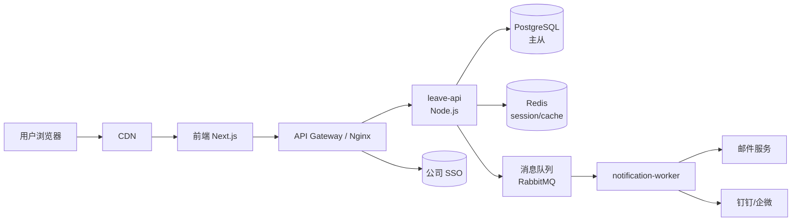
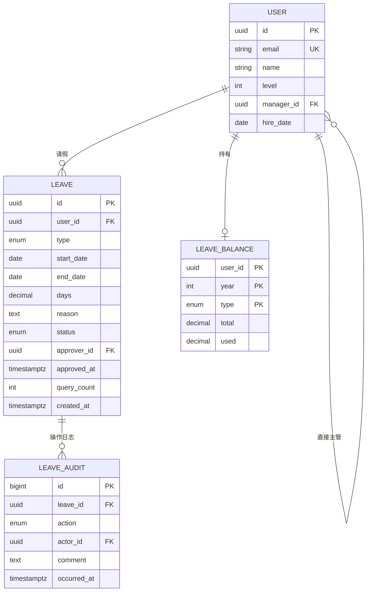
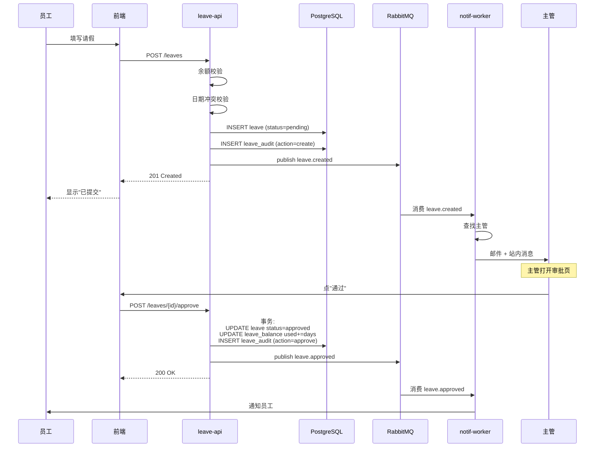

# 员工请假管理系统 · 概要设计 v1.0

**设计负责人**: 李架构
**评审状态**: 已批准
**关联 PRD**: [prd-v1.0.md](../01-business/prd-v1.0.md)
**最后更新**: 2026-04-08

## 1. 背景与目标

### 1.1 需求背景

替代现有"钉钉填表 + 邮件审批"流程，公司规模 300 人，请假流程每年涉及 ~3000 条记录。

### 1.2 设计目标

- 业务目标：统一员工 / 主管 / HR 入口
- 技术目标：
  - 单实例可支撑 300 人并发
  - 99.5% 可用性（一般业务系统标准）
  - 可在 4 周内交付 v1.0

### 1.3 范围

**In Scope**:
- 请假发起 / 审批 / 查询
- 假期余额管理
- HR 统计导出

**Out of Scope**:
- 多级审批（v2）
- 与薪资系统集成（v2）
- 移动端（v2）

## 2. 现状分析

现状：无系统，纯邮件流程。

瓶颈：
- HR 每月手工汇总 16 小时
- 平均审批时长 2 天
- 经常漏审批

## 3. 总体方案

### 3.1 架构图



### 3.2 关键模块

| 模块 | 职责 | 是否新增 |
|------|------|---------|
| leave-api | 请假业务逻辑主服务 | ✅ 新增 |
| notification-worker | 异步通知 | ✅ 新增 |
| 前端 | Next.js SPA | ✅ 新增 |
| PostgreSQL | 数据存储 | ✅ 新增实例 |
| Redis | Session + 热点缓存 | 复用公司现有 |
| RabbitMQ | 异步通知 | 复用公司现有 |
| SSO | 认证 | 接公司现有 |

### 3.3 数据流（请假发起）

```
员工浏览器
    ↓ HTTPS
Gateway (认证)
    ↓
leave-api
    ├→ PostgreSQL 写入 leave（状态=pending）
    ├→ Redis 更新用户请假缓存
    └→ RabbitMQ 发送 "leave.created" 事件
              ↓
        notification-worker 消费
              ├→ 邮件服务
              └→ IM 服务
```

## 4. 方案选型

### 4.1 数据库选型

参见 [ADR-0001](./adr/0001-use-postgresql.md)。**结论**: PostgreSQL 15。

### 4.2 后端语言选型

**候选**：Node.js / Python / Go

**对比**：

| 维度 | Node.js | Python | Go |
|------|--------|--------|-----|
| 团队熟悉度 | 高 | 中 | 低 |
| 开发速度 | 快 | 快 | 中 |
| 性能 | 中 | 低 | 高 |
| 生态（ORM、验证） | 丰富 | 丰富 | 中 |

**结论**: **Node.js + TypeScript + Fastify + Prisma**。理由：
- 团队现有技术栈，学习成本低
- 本项目对性能要求不高（QPS 几十到几百），Node.js 够用
- Prisma 的 migration 体验好

### 4.3 前端选型

**结论**: Next.js 14（App Router） + Tailwind + shadcn/ui。理由：
- 团队技术栈
- 内置 SSR 加速首屏
- 现成 UI 库,开发快

## 5. 关键设计

### 5.1 数据模型



**关键设计**:
- `User` 用 UUID,避免与外部 ID 混淆
- `Leave.days` 用 `decimal(3,1)`,支持 0.5 半天粒度
- `Leave.query_count` 记录问询次数,用于触发"3 次自动驳回"
- `LEAVE_AUDIT` 单独表，所有操作日志追加不删改

### 5.2 接口契约

**核心接口**:

| 接口 | 方法 | 文档 |
|------|------|------|
| 发起请假 | POST /api/v1/leaves | [create-leave.md](./api-docs/create-leave.md) |
| 列表查询 | GET /api/v1/leaves | [list-leaves.md](./api-docs/list-leaves.md) |
| 查询余额 | GET /api/v1/leaves/balance | （本示例省略） |
| 审批操作 | POST /api/v1/leaves/:id/approve | |
| 审批驳回 | POST /api/v1/leaves/:id/reject | |
| 审批问询 | POST /api/v1/leaves/:id/query | |

### 5.3 核心流程（请假审批时序图）



### 5.4 异常处理策略

| 异常 | HTTP | 错误码 | 处理 |
|------|------|-------|------|
| 余额不足 | 400 | 1001 | 返回当前余额和需要数量 |
| 日期冲突 | 409 | 1002 | 返回冲突的请假单 ID |
| 参数校验 | 400 | 1003 | 返回字段级错误 |
| 无权审批 | 403 | 2001 | |
| 状态非法（对已 approved 再审批） | 409 | 2002 | |
| 系统错误 | 500 | 5000 | 不暴露细节,返回 traceId |

### 5.5 扩展性

**预留的扩展点**:
- `approver_id` 是单个 UUID → v2 多级审批时改成 JSONB 数组
- `type` 是 enum → v2 支持自定义假期类型时改成关联表
- `LeaveConfig` 表（本期未实现）→ 存放假期配置，HR 可调

## 6. 非功能性设计

### 6.1 性能

| 接口 | 目标 | 设计依据 |
|------|------|---------|
| POST /leaves | P99 ≤ 500ms | DB 单写 + 1 次 MQ,测算 ~100ms |
| GET /leaves | P99 ≤ 300ms | 带索引查询 + 分页 |
| GET /balance | P99 ≤ 100ms | Redis 缓存 |
| 月度导出 | ≤ 10s | 3 万行,流式生成 xlsx |

### 6.2 可用性

- SLA: 99.5%
- 单点风险: PostgreSQL → 用主从（v1 先主一个,v2 加从库）

### 6.3 安全

- SSO 认证
- RBAC：员工 / 主管 / HR / Admin 四角色
- 审计：所有 CUD 操作记录到 LEAVE_AUDIT

### 6.4 可观测性

**Prometheus 指标**:
- `leave_api_request_duration_seconds` (by endpoint, status)
- `leave_created_total` (by type)
- `leave_approval_lag_hours` (直方图)
- `leave_balance_insufficient_total`

**日志字段**（结构化 JSON）:
- 必带: trace_id, user_id, endpoint, duration_ms, status
- 业务: leave_id, action

## 7. 迁移与发布

### 7.1 数据迁移

无历史数据迁移（首次上线）。

### 7.2 灰度

按用户灰度: 先 HR 部门 5 人 → 再 IT 部门 30 人 → 最后全员。

### 7.3 回滚

- 应用级回滚：5 分钟
- 数据回滚：migration 有对应 rollback 脚本

## 8. 对依赖方的要求

### 8.1 对测试
- 测试环境地址: https://leave-test.internal.company.com
- 账号：准备员工 / 主管 / HR 三类共 10 个测试账号
- 测试数据：用 seed 脚本生成

### 8.2 对运维
- 新增 2 个服务（leave-api、notification-worker）
- 新增 PostgreSQL 实例（主从,各 4c8g）
- 监控已配置在公司标准 Grafana
- 告警发送到 #oncall-hr 企微群

## 9. 风险与遗留

| 风险 | 可能性 | 影响 | 缓解 |
|------|-------|------|------|
| SSO 集成延期 | 中 | 高 | 提前对接,有用户名密码 fallback |
| 并发修改余额 | 中 | 中 | 用数据库行锁 + 乐观锁版本号 |

### 技术债

- v1.0 单库部署，未做分库（300 人规模够用）
- 邮件发送未做重试（worker 挂了会丢）→ v1.1 补

### 遗留决策

- 是否接入公司数据平台（做 BI）→ 先不接，v2 评估

## 10. 附录

### 参考资料
- [PRD v1.0](../01-business/prd-v1.0.md)
- [ADR-0001: 使用 PostgreSQL](./adr/0001-use-postgresql.md)

### 评审记录

| 日期 | 评审人 | 意见 | 采纳 |
|------|-------|------|------|
| 2026-04-06 | 架构委员会 | 建议补充状态机图 | ✅ |
| 2026-04-07 | 测试团队 | 补充异常处理章节 | ✅ |
| 2026-04-08 | 运维团队 | 补充监控指标设计 | ✅ |

### 变更历史

| 版本 | 日期 | 变更人 | 主要变更 |
|------|------|-------|---------|
| v0.1 | 2026-04-05 | 李架构 | 初稿 |
| v1.0 | 2026-04-08 | 李架构 | 评审通过定稿 |
