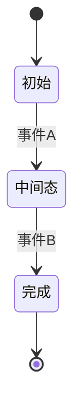

# 业务规则模板（决策表 + 状态机）

> 参考规范：[docs/chapters/02-business/03-business-rules.md](../../docs/chapters/02-business/03-business-rules.md)

---

## 业务规则 BR-[模块]-[编号]

**规则名称**: [简短描述]
**归属模块**: [模块名]
**Owner**: [姓名 + 角色]
**当前版本**: v1.0
**生效日期**: YYYY-MM-DD

### 1. 规则背景

[为什么需要这条规则？解决什么问题？]

### 2. 规则类型

- [ ] 决策规则（给定条件 → 给定结果）
- [ ] 状态转换规则
- [ ] 校验规则
- [ ] 约束规则

### 3. 决策表（若适用）

#### 3.1 条件变量

| 变量 | 可选值 | 说明 |
|------|-------|------|
| 条件 1 | A / B / C | |
| 条件 2 | 是 / 否 | |
| 条件 3 | < 100 / 100-999 / ≥ 1000 | |

#### 3.2 决策表

| # | 条件 1 | 条件 2 | 条件 3 | 结果 | 备注 |
|---|--------|--------|--------|------|------|
| 1 | A | 是 | < 100 | R1 | |
| 2 | A | 是 | 100-999 | R2 | |
| 3 | A | 是 | ≥ 1000 | R3 | |
| 4 | A | 否 | 任意 | R4 | |
| ... | | | | | |

#### 3.3 覆盖度检查

- [ ] 每个条件组合都有对应结果（不遗漏）
- [ ] 无冲突规则（同条件不同结果）
- [ ] 无不可达规则（永远不会触发）

### 4. 状态机（若适用）

#### 4.1 状态列表

| 状态 | 描述 | 入口 | 出口 |
|------|------|------|------|
| | | | |

#### 4.2 状态转换表

| 当前状态 | 事件 | 条件 | 新状态 | 副作用 |
|---------|------|------|-------|-------|
| | | | | |

#### 4.3 状态图

### 5. 校验规则（若适用）

| 字段 | 校验规则 | 错误提示 |
|------|---------|---------|
| | | |

### 6. 约束规则（若适用）

**不变式**（Invariant，永远应该成立的条件）：
- [条件描述]

**互斥规则**：
- [A 和 B 不能同时发生]

### 7. 示例

**示例 1**（覆盖决策表第 1 行）:
- 输入: ...
- 预期结果: ...

**示例 2**（覆盖异常情况）:
- 输入: ...
- 预期结果: ...

### 8. 对代码的要求

- [ ] 规则实现要与本文档一致
- [ ] 代码注释引用 `BR-模块-编号`
- [ ] 单元测试覆盖每一行决策表
- [ ] 状态转换有完整的测试

### 9. 对测试的要求

- [ ] 每个条件组合至少 1 个用例
- [ ] 边界值覆盖
- [ ] 异常场景覆盖
- [ ] 状态转换的所有路径覆盖

### 10. 变更历史

| 版本 | 日期 | 变更人 | 变更内容 |
|------|------|-------|---------|
| v1.0 | YYYY-MM-DD | | 初版 |
