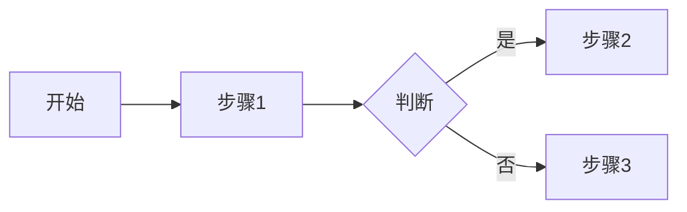
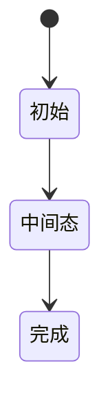

# PRD 模板

> 参考规范：[docs/chapters/02-business/01-prd-standards.md](../../docs/chapters/02-business/01-prd-standards.md)
>
> **使用方式**：复制到你的仓库/Wiki，把 `[xxx]` 替换为实际内容。

---

# [需求名称] - v[版本号]

**文档 Owner**: [姓名]
**最后更新**: YYYY-MM-DD
**状态**: 草稿 / 评审中 / 已批准 / 已归档

## 1. 概述

### 1.1 背景
[为什么做这个需求？不做会怎样？解决什么问题？]

### 1.2 目标
[做成什么样？预期指标（如转化率提升 X%、时间节省 Y 小时）]

### 1.3 非目标
[明确不做什么，避免范围蔓延]

### 1.4 术语表
| 术语 | 定义 |
|------|------|
| | |

## 2. 用户与场景

### 2.1 目标用户
- 角色 1: [描述]
- 角色 2: [描述]

### 2.2 典型使用场景
[描述用户在什么情况下、为什么、如何使用]

### 2.3 用户故事地图
```
[按时间流或业务流组织的故事地图]
```

## 3. 功能需求

### 3.1 功能清单（按优先级）

| 需求 ID | 功能 | 优先级 | 备注 |
|---------|------|--------|------|
| REQ-001 | | P0 | |
| REQ-002 | | P1 | |

### 3.2 详细需求

#### REQ-001 [功能名称]

**优先级**: P0

**验收标准**:

**AC-1 [场景名]**
- **Given**: [前置条件]
- **When**: [触发动作]
- **Then**: [预期结果]

**AC-2 [场景名]**
- Given: ...
- When: ...
- Then: ...

**业务规则**:
- 规则 1: ...
- 规则 2: ...

**异常场景**:
- 场景 A: ...
- 场景 B: ...

**数据规则**:
- 字段 X: 类型/格式/必填
- 字段 Y: ...

### 3.3 业务规则表（决策表）

| # | 条件 1 | 条件 2 | 条件 N | 结果 |
|---|--------|--------|--------|------|
| | | | | |

## 4. 非功能需求

### 4.1 性能
- QPS 目标: [数字]
- 响应时间: P99 ≤ [数字] ms
- 并发: [数字]
- 容量: [数字]

### 4.2 安全
- 认证方式:
- 数据加密:
- 权限粒度:
- 审计要求:

### 4.3 兼容性
- 浏览器:
- 操作系统:
- 语言/地区:

### 4.4 可访问性（A11y）
- [对应标准]

## 5. 数据规则

### 5.1 数据字典
| 实体 | 字段 | 类型 | 约束 | 说明 |
|------|------|------|------|------|
| | | | | |

### 5.2 数据关系
[ER 图或文字描述]

### 5.3 数据校验规则
| 字段 | 规则 | 错误提示 |
|------|------|---------|
| | | |

## 6. 交互设计

### 6.1 业务流程图


### 6.2 状态机


### 6.3 原型/UI 稿
- [链接]

## 7. 对依赖方的要求

### 7.1 对开发的要求
- [ ] 数据库变更需提供迁移脚本
- [ ] 接口文档同步更新
- [ ] 监控埋点

### 7.2 对测试的要求
- [ ] 覆盖异常场景
- [ ] 性能测试
- [ ] 兼容性测试

### 7.3 对运维的要求
- [ ] 灰度方案
- [ ] 监控大盘
- [ ] 应急预案

## 8. 风险与边界

### 8.1 已识别风险
| 风险 | 可能性 | 影响 | 缓解措施 |
|------|-------|------|---------|
| | | | |

### 8.2 超出本期范围（Out of Scope）
- ...

### 8.3 遗留决策
- 待决项 1: [谁负责、何时决策]

## 9. 变更历史

| 版本 | 日期 | 变更人 | 主要变更 |
|------|------|-------|---------|
| v1.0.0 | YYYY-MM-DD | [姓名] | 初版 |
