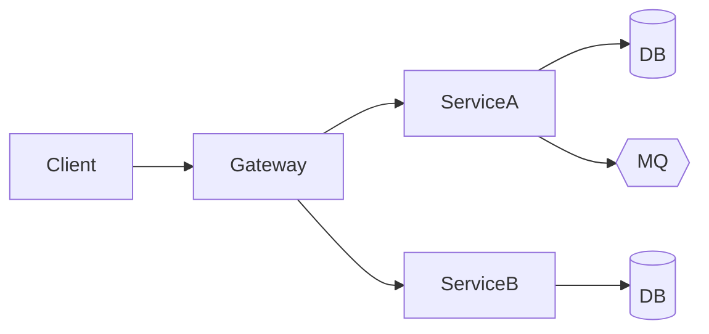
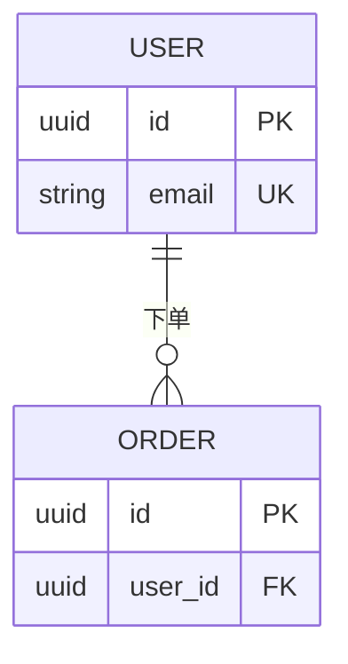
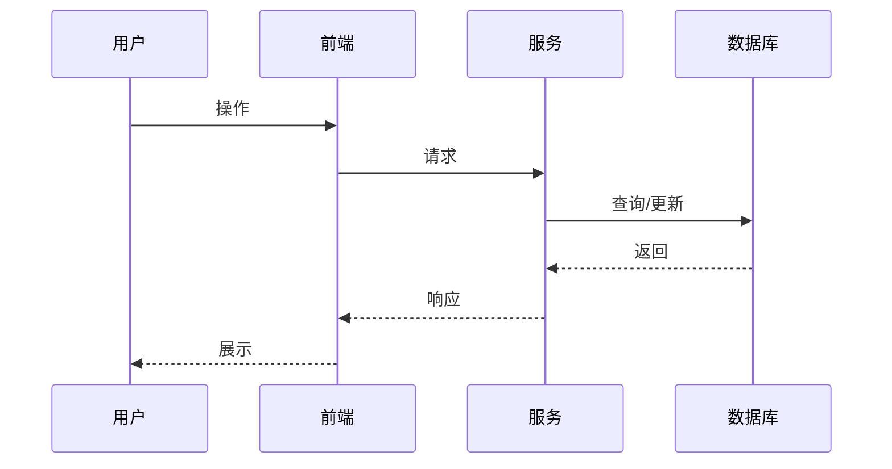

# 概要设计文档模板

> 参考规范：[docs/chapters/03-development/01-design-standards.md](../../docs/chapters/03-development/01-design-standards.md)

---

# [需求/模块名称] 概要设计

**设计负责人**: [姓名]
**评审状态**: 草稿 / 评审中 / 已批准
**版本**: v1.0
**关联 PRD**: [链接]
**最后更新**: YYYY-MM-DD

## 1. 背景与目标

### 1.1 需求背景
[引用 PRD 的关键内容，1 段话摘要]

### 1.2 设计目标
- 业务目标: ...
- 技术目标: ...
- 非目标（明确不做什么）: ...

### 1.3 范围

**In Scope**:
- ...

**Out of Scope**:
- ...

## 2. 现状分析

### 2.1 现有系统架构
```
[当前架构图，可用 Mermaid]
```

### 2.2 现有数据模型
```
[关键表 + 关系]
```

### 2.3 现有瓶颈/问题
- ...

## 3. 总体方案

### 3.1 架构图



### 3.2 关键模块

| 模块 | 职责 | 是否新增 |
|------|------|---------|
| | | |

### 3.3 数据流
[核心数据如何流转]

### 3.4 外部依赖

| 依赖 | 类型 | 用途 | 是否新增 |
|------|------|------|---------|
| | 服务 / DB / MQ | | |

## 4. 方案选型

### 4.1 候选方案

**方案 A: [名称]**
- 实现思路: ...
- 优点: ...
- 缺点: ...

**方案 B: [名称]**
- 实现思路: ...
- 优点: ...
- 缺点: ...

### 4.2 对比

| 维度 | 方案 A | 方案 B | 权重 |
|------|-------|-------|------|
| 性能 | | | 高 |
| 实现成本 | | | 中 |
| 维护成本 | | | 高 |
| 扩展性 | | | 中 |
| 风险 | | | 高 |

### 4.3 推荐方案
**选择方案 [X]**，理由：
- ...

## 5. 关键设计

### 5.1 数据模型



**新增表**:
- [表名]: 用途 + 关键字段

**变更表**:
- [表名]: 变更说明

### 5.2 接口契约

参见接口文档：[链接到 API 文档]

关键接口列表：
| 接口 | 方法 | 路径 | 说明 |
|------|------|------|------|
| | GET/POST/... | /api/... | |

### 5.3 核心流程



### 5.4 异常处理策略

| 异常类型 | 处理策略 |
|---------|---------|
| 业务异常 | 返回明确错误码 |
| 参数异常 | 400 + 字段清单 |
| 依赖异常 | 熔断 + 降级 |
| 系统异常 | 500 + 记录 traceId |

### 5.5 扩展性考虑
[未来可能的变化，当前设计如何应对]

## 6. 非功能性设计

### 6.1 性能

| 指标 | 目标 | 设计依据 |
|------|------|---------|
| QPS | | |
| P99 延迟 | | |
| 并发数 | | |

### 6.2 可用性

- SLA 目标: [99.9%]
- 容灾方案: [主备 / 多活]
- 故障切换时间: [RTO]
- 数据恢复点: [RPO]

### 6.3 安全

- 认证: ...
- 授权: ...
- 数据加密: 传输 / 存储
- 审计: ...

### 6.4 可观测性

**监控指标**:
- [指标清单]

**日志埋点**:
- [关键日志点]

**告警规则**:
- [告警条件 + 阈值]

## 7. 迁移与发布

### 7.1 数据迁移方案

- 需要迁移的数据: [列表]
- 迁移方式: [一次性 / 分批 / 在线]
- 预估时长: [时间]
- 回滚预案: [方案]

### 7.2 灰度发布

- 灰度策略: [按用户 / 按流量 / 按地域]
- 灰度节奏: [1% → 10% → 50% → 100%]
- 验证指标: [关键监控]

### 7.3 回滚方案

- 触发条件: [什么情况回滚]
- 回滚步骤: [具体操作]
- 数据回滚: [如何处理]

## 8. 对依赖方的要求

### 8.1 对测试
- 需准备测试环境: [描述]
- 需要的测试数据: [描述]
- 需覆盖的测试场景: [清单]

### 8.2 对运维
- 需准备的基础设施: [资源]
- 部署方式: [描述]
- 监控看板: [链接]

### 8.3 对前端 / 客户端
- 新增接口: [列表]
- 变更接口: [列表]
- 新增字段: [列表]

## 9. 风险与遗留

### 9.1 技术风险

| 风险 | 可能性 | 影响 | 缓解 |
|------|-------|------|------|
| | | | |

### 9.2 技术债

- [待后续优化的点]

### 9.3 遗留决策

- [决策 1: 谁负责 + 何时决策]

## 10. 附录

### 10.1 参考资料

> 示例（替换为实际链接）：
> - `[ADR-0001](../adr/0001-use-postgresql.md)`
> - `[PRD](<your-prd-url>)`
> - 外部资料: [说明]

### 10.2 评审记录

| 日期 | 评审人 | 主要意见 | 采纳情况 |
|------|-------|---------|---------|
| | | | |

### 10.3 变更历史

| 版本 | 日期 | 变更人 | 主要变更 |
|------|------|-------|---------|
| v1.0 | | | 初版 |
